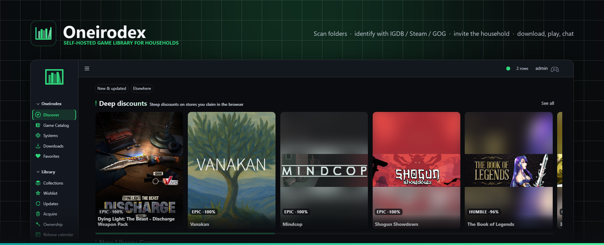
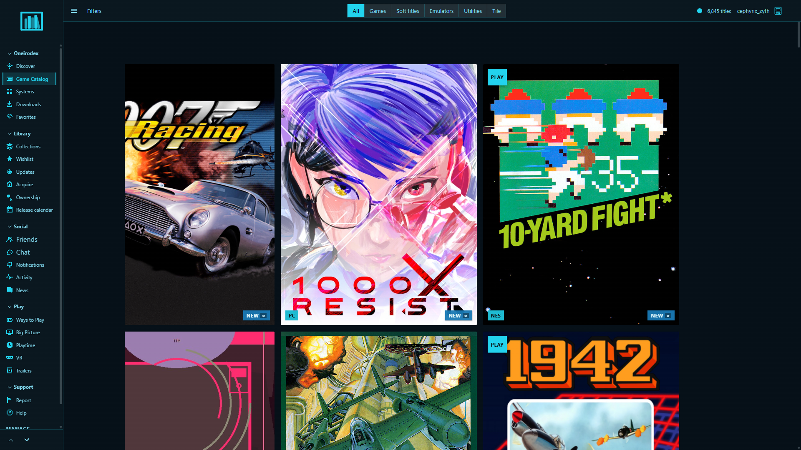
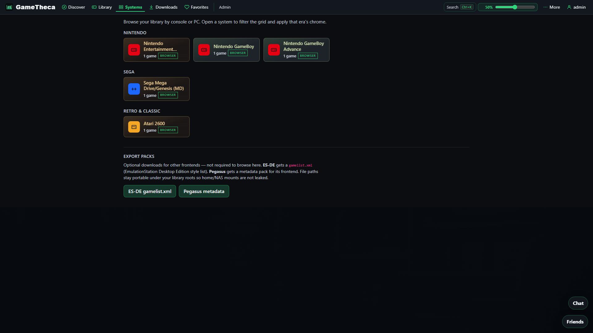

<p align="center">
  
</p>

<h1 align="center">GameTheca</h1>

<p align="center">
  <strong>Self-hosted multi-user game library</strong> for households &amp; small communities.<br/>
  Scan folders · enrich with metadata · invite members · download · play · chat.
</p>

<p align="center">
  
</p>

<p align="center">
  <a href="CHANGELOG.md"></a>
  <a href="https://github.com/chrisjrovira/gametheca"></a>
  <a href="#-quick-start"></a>
  <a href="#-docker-compose"></a>
  <a href="docs/README.md"></a>
</p>

<p align="center">
  <a href="#-features">Features</a> ·
  <a href="#-screenshots">Screenshots</a> ·
  <a href="#-quick-start">Quick start</a> ·
  <a href="#-configuration">Config</a> ·
  <a href="#-troubleshooting">Troubleshooting</a> ·
  <a href="#-documentation">Docs</a>
</p>

---

## ✨ What is GameTheca?

GameTheca is a **Flask + React** game library server you run at home (or on a NAS). Point it at folders of DRM-free games, identify them with IGDB / Steam / GOG / RAWG, then give household members a modern browser UI to browse, download, play in-browser (where supported), and hang out.

| | |
|---|---|
| 🏷️ **Release** | [0.2.0](CHANGELOG.md) (in progress) · [`VERSION`](VERSION) |
| 📦 **Package** | `gametheca/` |
| 🐳 **Containers** | `gametheca-app` · `gametheca-db` · optional `gametheca-livekit` |
| 🌐 **Default URL** | http://localhost:5006 |
| 🖼️ **Image** | Local Compose build `gametheca:0.2.0` (Hub publish optional) |

> **Legal:** Use only with software you are authorized to share. GameTheca does **not** include Discord bots, pirate marketplaces, or DRM store download queues. **Authentik / OIDC is optional** — local username/password works for home installs.

---

## 🚀 Features

### 📚 Library & discovery
- 🔍 Multi-threaded folder scanning & identification (IGDB · Steam · GOG · RAWG)
- 🖼️ Covers, screenshots, filters, discovery shelves, **Systems** hub by console family
- 🛍️ **Storefront Discover** — *Curated for you* + *Upcoming* shelves, hero / carousel layouts, and **shelves as timed events** with start & end dates — [discover-sections.md](docs/admin/discover-sections.md)
- 🏷️ Library badges & freshness (`NEW` · `UPDATE` · `OUT` / `~`)
- 📊 ROM **set completeness** (upload your own No-Intro / Redump DATs) + multi-region heatmap chips
- 🌐 ROM language chips · preferred `en-US` · optional translation / patch catalog hooks
- 🎞️ **Related media** on a game — adaptations, tie-ins, soundtracks as context (never a tracker, never a download)

### 👥 Household access
- ✉️ Invite-based membership + parental / library ACL
- 🎨 Color themes **and** independent icon packs (Outline · Filled · Duotone · Pixel · Soft · Mono)
- 🔤 **Themeable fonts** with era-appropriate faces per system — files are operator-supplied ([theme-fonts-and-images.md](docs/admin/theme-fonts-and-images.md))
- 📱 Mobile density polish (hamburger nav · stacked filters · Chat touch targets ≤900px)

### 🎮 Play & companion
- 🌍 Browser play via **WebRetro** (cloud save bridge · cheats) for supported systems
- 💻 **Desktop companion** (Tauri) for install / launch / updates · unsigned by default
- 💾 Emulator BIOS admin · companion core honesty badges on Systems — [emulator-bios.md](docs/runbooks/emulator-bios.md)
- 🛋️ Play **rooms** grouped by setting (CRT living room · arcade cabinet · handheld · disc era · desk)
- 📝 **PC cheat notes** — reference notes, not a trainer; never writes game binaries

### 💬 Social & support
- 🏛️ **Spaces** — servers with their own text *and* voice channels, household-wide or invite-only
- 🟢 Presence · profiles · notifications · DMs · household channels · @mentions · reactions · threads
- 👥 **Friends companion** (dock · pop-out · Big Picture **Y** · desktop always-on-top window)
- 🎙️ Optional **LiveKit** voice (`docker compose --profile livekit`)
- 🎫 In-app **Report issue** → admin Support inbox (+ GitHub Issues when configured)

### 🧩 Optional modules
- 📡 *arr + hardlink pipeline · 🤖 Ollama AI assist · 🥽 VR / Quest PWA · 🔐 OIDC / Authentik SSO (opt-in)
- 🖌️ **Generated cover art** against your own self-hosted A1111-compatible endpoint (AUTOMATIC1111 · SD.Next · Forge) — **off by default**, nothing leaves your network
- 🛡️ Login rate limit (app + [proxy runbook](docs/runbooks/login-rate-limit-proxy.md)) · malware scan (heuristics on by default; optional [ClamAV profile](docs/runbooks/docker-compose-deploy.md#clamav-malware-scan))
- ⚙️ Most `ENABLE_*` modules **on** by default — OIDC, AI auto-apply, and hardlink apply stay off until you opt in ([settings-modules.md](docs/admin/settings-modules.md))

---

## 🖼️ Screenshots

<p align="center">
  
  <br/><em>Library — filters, tiles, and freshness badges</em>
</p>

<p align="center">
  
  <br/><em>Systems — browse by console family &amp; set completion</em>
</p>

<p align="center">
  <em>Chat — household channels, DMs, reactions — live capture queued (<a href="docs/assets/readme/CAPTURE.md">CAPTURE.md</a>)</em>
</p>

<details>
<summary>📷 Asset credits</summary>

Live UI captures live in [`docs/assets/readme/`](docs/assets/readme/) (synced from [`docs/media/screenshots/`](docs/media/screenshots/) via [`scripts/capture_docs_media.py`](scripts/capture_docs_media.py)). The controller mark is the product SVG (`gametheca_mark.svg`). Docs re-runs capture on every commit/ship pass that touches member or admin UI.

</details>

---

## ⚡ Quick start

### 🐧 Linux installer

```bash
git clone --depth 1 https://github.com/chrisjrovira/gametheca.git
cd gametheca
chmod +x install-linux.sh
./install-linux.sh
```

Useful flags: `--games-dir /path/to/games` · `--dev` · `--no-db` · `--force`

### 🐳 Docker Compose

```bash
cp .env.docker.example .env
# Unraid: prefer .env.unraid.example (Compose Manager paths + volume sectioning)
# Required: SECRET_KEY, DATA_FOLDER_GAMES (host games path), LIBRARY_HOST_PATH
# Do NOT use DATABASE_URL=@localhost — Compose talks to service "db"
docker compose up -d --build

# Optional household voice:
# ENABLE_LIVEKIT=true LIVEKIT_URL=ws://<lan-host>:7880 docker compose --profile livekit up -d

# Optional ClamAV daemon (heuristics run without it when ENABLE_MALWARE_SCAN=true):
# CLAMAV_HOST=clamav CLAMAV_PORT=3310 docker compose --profile clamav up -d
```

Open **http://localhost:5006** — Postgres is the `db` service; games mount at `/storage`.

| Deploy | Guide |
|---|---|
| 🏠 Unraid / NAS | [NAS-DEPLOY.md](NAS-DEPLOY.md) · [unraid-deploy.md](docs/runbooks/unraid-deploy.md) |
| 🐳 Compose deep dive | [docker-compose-deploy.md](docs/runbooks/docker-compose-deploy.md) |
| 🔥 Won’t start | [container-wont-start.md](docs/runbooks/container-wont-start.md) |

### 💻 Manual (Windows / Linux)

1. PostgreSQL **17+** with a `gametheca` database  
2. Copy `.env.example` → `.env` — set `DATABASE_URL`, `SECRET_KEY`, `DATA_FOLDER_GAMES`, `UPLOAD_FOLDER`  
3. `pip install -r requirements.txt`  
4. `./startweb.sh` or `startweb_windows.cmd`

Force the setup wizard: `./startweb.sh --force-setup` (required when upgrading from &lt; 2.0).

---

## ⚙️ Configuration

| Variable | Purpose |
|---|---|
| `DATABASE_URL` | Postgres URL (`db` host inside Compose) |
| `SECRET_KEY` | **Required** — container refuses the placeholder |
| `DATA_FOLDER_GAMES` | Root of on-disk games — **required** (see upgrade note below) |
| `UPLOAD_FOLDER` | Covers / themes (Compose: `/app/gametheca/static/library`) |
| `LIBRARY_HOST_PATH` | Host path mounted to `UPLOAD_FOLDER` in Docker |
| `ENABLE_LIVEKIT` / `LIVEKIT_*` | Household voice (on by default; needs secrets + profile) |
| `ENABLE_MALWARE_SCAN` / `MALWARE_SCAN_BLOCK_ON_HIT` / `CLAMAV_*` | Malware scanner — heuristics on by default; blocks/skips adds on hit; optional `--profile clamav` |
| `SUPPORT_GITHUB_TOKEN` / `SUPPORT_GITHUB_REPO` | Optional GitHub Issues sync for support tickets |
| `ENABLE_ARR_MODULE` | *arr search / qBittorrent (on by default) |
| `ENABLE_AI_ASSIST` / `ENABLE_AI_AUTO_APPLY` | Ollama triage (on); silent rename stays off |
| `ENABLE_VR_BROWSE` | `/vr` PWA catalog (on by default) |
| `OIDC_ENABLED` | SSO — **off by default** (auth stays opt-in) |
| `ALLOW_PRIVATE_LAN_URLS` | Allow *arr / Ollama on RFC1918 (on for homelab) |
| `OIDC_LOCK_ROLES` | Don’t overwrite roles on every SSO login |
| `ENABLE_LOGIN_RATE_LIMIT` | In-process login / reset rate limit (default on) |
| `ENABLE_PATCH_CATALOG` / `ENABLE_ROM_AI_TRANSLATE` | ROM patch / AI translate hooks (on by default) |
| `ENABLE_AI_ARTWORK` / `AI_ARTWORK_URL` / `AI_ARTWORK_ENGINE` | Generated cover art — **off by default**; point at your own A1111-compatible endpoint (`a1111` engine covers AUTOMATIC1111 / SD.Next / Forge) |
| `SCAN_CHECK_FRESHNESS` / `SCAN_FRESHNESS_LIMIT` | Check versions / updates / DLC after a scan — **off by default** (it is store HTTP traffic); cap defaults to 50 titles |
| `DAT_HASH_INNER_ARCHIVE` | Open zip/7z/rar and hash the inner dump when the outer archive hash misses (on) |
| `FONT_PATH` / `FONT_MAX_BYTES` | Where uploaded theme fonts live (default `static/library/fonts`) and the per-file cap (default 8MB) |

Full lists: [`.env.example`](.env.example) · [`.env.docker.example`](.env.docker.example) · [`.env.unraid.example`](.env.unraid.example) · [settings-modules.md](docs/admin/settings-modules.md)

> ⚠️ **Upgrading from ≤ 0.1.0:** `DATA_FOLDER_WAREZ` has been **removed**, including the Compose volume fallback that quietly used it. If your `.env` still sets only that key, the container starts with no games mounted at `/storage`. Rename it to `DATA_FOLDER_GAMES` before you redeploy.

---

## 🧭 Architecture (at a glance)

```text
┌─────────────────┐     ┌──────────────────┐     ┌────────────┐
│  Member SPA     │     │  Admin SPA       │     │  Desktop   │
│  (React)        │     │  (React + Jinja) │     │  companion │
└────────┬────────┘     └────────┬─────────┘     └─────┬──────┘
         │                       │                     │
         └───────────┬───────────┴─────────────────────┘
                     ▼
            ┌────────────────┐
            │  Flask app     │  ← gametheca/  :5006
            │  APIs + auth   │
            └───────┬────────┘
                    │
         ┌──────────┼──────────┐
         ▼          ▼          ▼
    PostgreSQL   Games vol   Optional LiveKit
```

| Layer | Location |
|---|---|
| Member UI | `frontend/member-app` → `/static/dist/member-app/` |
| Admin UI | `frontend/admin-app` → `/static/dist/admin-app/` |
| API / server | `gametheca/` |
| Desktop | `clients/desktop/` |
| Docs | `docs/` |

---

## 🔧 Troubleshooting

Quick triage — full guides: [member](docs/user/troubleshooting.md) · [admin](docs/admin/troubleshooting.md) · [container won’t start](docs/runbooks/container-wont-start.md)

### 🚨 Container / boot

| Symptom | Likely fix |
|---|---|
| Exit / restart loop + `SECRET_KEY` error | Set a real `SECRET_KEY` (not the placeholder) |
| Can’t reach DB | Compose host must be `db`, not `localhost` |
| `no pg_hba.conf entry … no encryption` | Recreate db with Compose `hba_file` mount — [container-wont-start §3b](docs/runbooks/container-wont-start.md#3b-postgres-up-but-pg_hba-rejects-app-no-encryption) |
| Port in use | Change published `5006` mapping |
| Unstyled Library / Discover | Rebuild image so `member-app` dist exists |
| Discover stuck on Loading; logs show stream but no `/api/discover/sections` | Rebuild app with ASGI SSE fix — [admin troubleshooting](docs/admin/troubleshooting.md#spa-navigates-but-pagesadmin-hang-discover-stuck-on-loading) |

```bash
docker compose logs app --tail 200
docker compose build --no-cache && docker compose up -d
```

### 👤 Members

| Symptom | What to try |
|---|---|
| Spin forever / blank UI | Hard refresh · re-login · ask admin to check logs · clear Friends dock localStorage if Discover never leaves Loading |
| Download 404 / empty zip | Admin: verify games mount + re-scan |
| “Too many login attempts” | Wait a few minutes (rate limit) |
| Browser play won’t start | System may be companion-only · missing BIOS |
| Chat empty | Ask admin/librarian to create `#general` |
| Voice missing | LiveKit off or `LIVEKIT_URL` not reachable from the **browser** |

### 🛠️ Admins

| Symptom | What to try |
|---|---|
| Scans stuck | [libraries-and-scans.md](docs/admin/libraries-and-scans.md) |
| Support not on GitHub | Expected without `SUPPORT_GITHUB_TOKEN` — inbox still works |
| SSO fails | Env `OIDC_ENABLED` **and** Admin → Integrations |
| Themes look wrong after upgrade | [themes-reset.md](docs/admin/themes-reset.md) |

Still stuck? **More → Report issue** (members) or open a GitHub issue with deploy type, URL, and redacted logs.

---

## 📖 Documentation

| Audience | Start here |
|---|---|
| 👋 Members | [Getting started](docs/user/getting-started.md) · [FAQ](docs/user/faq.md) · [Troubleshooting](docs/user/troubleshooting.md) |
| 🎮 Play | [Browser play](docs/user/browser-play.md) · [Desktop companion](docs/user/desktop-companion.md) · [Free games](docs/user/free-games.md) |
| 💬 Social | [Social & voice](docs/user/social-and-voice.md) · [Spaces](docs/user/social-and-voice.md#spaces-servers-with-their-own-channels) |
| 🗂️ Library | [Library & systems](docs/user/library-and-systems.md) · [Translation patches](docs/user/translation-patches.md) |
| 🎨 Look & feel | [Preferences & themes](docs/user/preferences-themes.md) · [Fonts & image uploads](docs/admin/theme-fonts-and-images.md) |
| 🛡️ Admins | [Libraries & scans](docs/admin/libraries-and-scans.md) · [Discover sections](docs/admin/discover-sections.md) · [Support inbox](docs/admin/support-inbox.md) · [Settings modules](docs/admin/settings-modules.md) |
| 🚢 Operators | [Unraid](docs/runbooks/unraid-deploy.md) · [Compose](docs/runbooks/docker-compose-deploy.md) · [LiveKit](docs/runbooks/livekit-unraid.md) · [OIDC](docs/runbooks/oidc-sso.md) · [WebRetro cores](docs/runbooks/webretro-cores.md) · [Emulator BIOS](docs/runbooks/emulator-bios.md) · [Reference sets](docs/runbooks/reference-sets.md) |
| 🗺️ Roadmap | [Strategy](docs/strategy/README.md) · [Progress](docs/strategy/progress.md) · [Docs index](docs/README.md) |
| 🔌 API | [openapi.json](docs/openapi/openapi.json) |

---

## 🧑‍💻 Development

```bash
pip install -r requirements.txt

# Frontends
cd frontend/member-app && npm ci && npm test && npm run build
cd ../admin-app && npm ci && npm test && npm run build

# Backend smoke
pytest tests/test_security_suite.py tests/test_set_completion.py tests/test_login_rate_limit.py -q
```

Set `TEST_DATABASE_URL` (DB name must contain `test`, default `gamethecatest`) for DB-backed tests — [local-postgres-pytest.md](docs/runbooks/local-postgres-pytest.md).

**Agent workflow:** docs sync on every change (`.cursor/skills/docs-sync/`) · task briefing (`.cursor/skills/prompt-brief/`) — [agent-skills.md](docs/dev/agent-skills.md).

### Versioning

Product version is tracked in [`VERSION`](VERSION). Desktop, member-app, and related packages follow the same milestone number. See [CHANGELOG.md](CHANGELOG.md).

---

## ⚖️ License / legal

Use GameTheca only with software you are authorized to share. Unauthorized distribution of copyrighted material is not supported.

---

<p align="center">
  
  <br/>
  <sub>Built for households that keep their own libraries.</sub>
</p>
