<p align="center">
  
</p>

<h1 align="center">Oneirodex</h1>

<p align="center">
  <strong>The self-hosted game library for a household.</strong><br/>
  Scan folders · identify with IGDB / Steam / GOG · invite the family · download · play · chat.
</p>

<p align="center">
  <a href="CHANGELOG.md"></a>
  <a href="https://github.com/chrisjrovira/oneirodex"></a>
  <a href="#-quick-start"></a>
  <a href="#-quick-start"></a>
  <a href="docs/README.md"></a>
  <a href="LICENSE"></a>
</p>

<p align="center">
  
</p>

<p align="center">
  <a href="#-what-is-oneirodex">Overview</a> ·
  <a href="#-features">Features</a> ·
  <a href="#-screens">Screens</a> ·
  <a href="#-how-to-videos">Videos</a> ·
  <a href="#-quick-start">Quick start</a> ·
  <a href="#-scan-locations">Scan locations</a> ·
  <a href="#-configuration">Config</a> ·
  <a href="#-troubleshooting">Troubleshooting</a> ·
  <a href="#-documentation">Docs</a>
</p>

<br/>

<a id="-what-is-oneirodex"></a>
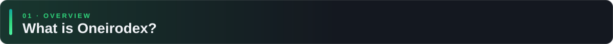

Oneirodex is a **Flask + React** server you run at home or on a NAS. Point it at folders of DRM-free games and ROMs, let it identify them against IGDB / Steam / GOG / RAWG, then give the household a modern browser app to **browse, download, play in the browser where a system supports it, and hang out** — with a desktop companion for PC titles and a ten-foot mode for the TV.

Every screenshot and clip on this page is **live UI** from a stock install seeded with five legal free ROMs: what you see is what ships.

<table>
<tr><td>🏷️ <b>Release</b></td><td><a href="CHANGELOG.md">1.0.0</a> · <a href="VERSION"><code>VERSION</code></a></td><td>🌐 <b>Default URL</b></td><td><code>http://localhost:5006</code></td></tr>
<tr><td>🐳 <b>Containers</b></td><td><code>oneirodex-app</code> · <code>oneirodex-db</code> · optional <code>oneirodex-livekit</code></td><td>🖼️ <b>Image</b></td><td>local Compose build <code>oneirodex:1.0.0</code></td></tr>
<tr><td>📦 <b>Package</b></td><td><code>oneirodex/</code> — Flask under ASGI (uvicorn)</td><td>🧩 <b>Front ends</b></td><td>member · admin · ops-glance SPAs, Tauri desktop, Quest PWA</td></tr>
</table>

> **Legal.** Use Oneirodex only with software you are authorised to share. It ships **no** Discord bots, pirate marketplaces or store download queues. **Authentik / OIDC is optional** — local username and password is the default for a home install.

<br/>

<a id="-features"></a>
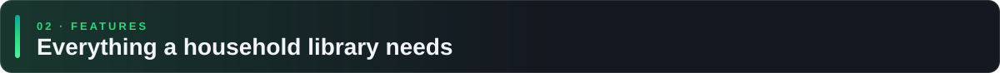

<table>
<tr>
<td>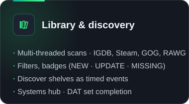</td>
<td>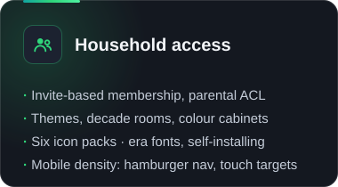</td>
<td>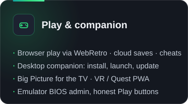</td>
</tr>
<tr>
<td>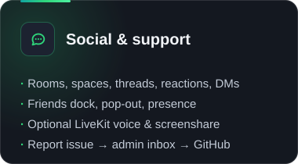</td>
<td>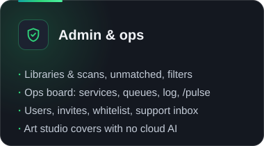</td>
<td>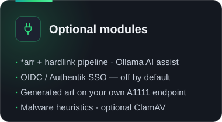</td>
</tr>
</table>

<details>
<summary><b>The long list</b> — every feature, with the guide that covers it</summary>

**Library & discovery**
- Multi-threaded folder scanning and identification (IGDB · Steam · GOG · RAWG); unmatched folders queue for a manual fix — [libraries-and-scans.md](docs/admin/libraries-and-scans.md)
- Covers, screenshots, filters, freshness badges (`NEW` · `UPDATE` · `MISSING`), and **Systems** by console family — [library-and-systems.md](docs/user/library-and-systems.md)
- **Storefront Discover** — *Curated for you* and *Upcoming* shelves, hero and carousel layouts, **shelves as timed events** with start and end dates — [discover-sections.md](docs/admin/discover-sections.md)
- ROM **set completeness** against your own No-Intro / Redump DATs, multi-region heatmap chips, language chips, preferred `en-US`, optional translation / patch catalog hooks — [reference-sets.md](docs/runbooks/reference-sets.md) · [translation-patches.md](docs/user/translation-patches.md)
- **Related media** on a game — adaptations, tie-ins, soundtracks as context; never a tracker, never a download
- **Keyless hash identify** for console ROMs after an IGDB and local-DAT miss, plus **TOSEC and MAME** reference sets and a **DAT repair preview** dry run — identity and reports only, never a download — [reference-sets.md](docs/runbooks/reference-sets.md)
- Collections, wishlist, favourites, downloads, an updates inbox, the IGDB release calendar, news feeds

**Household access**
- Invite-based membership with quotas and a whitelist; parental / library ACL; roles admin · librarian · member · child
- **Store ownership registers** — Steam / GOG / Epic / Amazon, plus unofficial opt-in Xbox and PlayStation; CSV import always works. A register of what you own, never a store download
- Colour themes **and** independent icon packs (Outline · Filled · Duotone · Pixel · Soft · Mono); **decade rooms** as scenery; **era fonts** that ship with Oneirodex and install themselves on boot — [preferences-themes.md](docs/user/preferences-themes.md) · [theme-fonts-and-images.md](docs/admin/theme-fonts-and-images.md)
- Mobile density: hamburger nav, stacked filters, Chat touch targets ≤ 900 px

**Play & companion**
- Browser play via **WebRetro** (cloud save bridge · cheats) for supported systems; Play buttons appear only where the core and BIOS are actually ready — [browser-play.md](docs/user/browser-play.md) · [webretro-cores.md](docs/runbooks/webretro-cores.md) · [emulator-bios.md](docs/runbooks/emulator-bios.md)
- **Desktop companion** (Tauri) for install / launch / updates, unsigned by default — [desktop-companion.md](docs/user/desktop-companion.md)
- **Big Picture** for the TV, VR / Quest PWA, play rooms grouped by setting, PC cheat *notes* that never touch a binary
- **An arcade path, opt-in** — choosing an arcade core is what lifts the catalogue-only lock, because promising Play with no core chosen would be a lie
- **A Mods panel** per title: tracked mods with the loader each needs, profiles and a shareable code, and a read-only catalogue browse (Thunderstore · Modrinth · GameBanana · Nexus *browse only*). The companion stages; nothing here installs a loader
- **Anti-cheat** and **save location** facts on PC pages, from community lists — reported, never guaranteed, and the save folder is opened, not copied

**Social & support**
- **Spaces** — servers with their own text *and* voice channels, household-wide or invite-only; presence, profiles, DMs, @mentions, reactions, threads — [social-and-voice.md](docs/user/social-and-voice.md)
- **Friends dock** (rail · pinned · pop-out · Big Picture **Y** · desktop always-on-top)
- Optional **LiveKit** voice and screenshare (`docker compose --profile livekit`) — [livekit-unraid.md](docs/runbooks/livekit-unraid.md)
- In-app **Report issue** → admin **Support inbox** → GitHub Issues when configured — [support-inbox.md](docs/admin/support-inbox.md)

**Admin & ops**
- Libraries & scans, scan jobs, unmatched, filters, release filters, extensions, image queue
- Dashboard and **Ops** boards: services, queues, companions, watch folders, the log; `/pulse` and `/awake` probes — [ops-summary.md](docs/admin/ops-summary.md)
- A **GPU tile** (NVIDIA NVML, or a BYO LibreHardwareMonitor / HWiNFO-class reader) and a **device list** of every companion, thin seat and shell that has sent a heartbeat — *n/a* when nothing answers, never a guess
- **Art studio** — covers rendered locally from a title (motifs, bezels, initials), SteamGridDB / IGDB picker, backup and stock, system marks
- Themes packs and Reset Themes, emulator profiles, settings modules — [settings-modules.md](docs/admin/settings-modules.md) · [themes-reset.md](docs/admin/themes-reset.md)

**Optional modules** — most `ENABLE_*` modules are **on** by default; OIDC, AI auto-apply and hardlink apply stay **off** until you opt in
- 📡 *arr + hardlink pipeline · 🤖 Ollama AI assist · 🔐 OIDC / Authentik SSO
- 🥽 **VR — any SteamVR / PSVR2-on-PC / Quest seat**: a headset-friendly `/vr` hub, honest *Plays in VR / community profile / plays flat* rows and a per-title headset record ([controllers-and-vr.md](docs/user/controllers-and-vr.md)); the runtime, adapter and streamer stay yours — [vr-byo-runtime.md](docs/runbooks/vr-byo-runtime.md) says which does what
- 🔔 **BYO notification bus** — fan in-app alerts out to an Apprise API server or an ntfy topic; nothing bundled, a dead endpoint never breaks the in-app notice
- 🖌️ Generated cover art against **your own** A1111-compatible endpoint (AUTOMATIC1111 · SD.Next · Forge) — nothing leaves your network; GPU-less NAS? [artwork-gpu-workstation.md](docs/runbooks/artwork-gpu-workstation.md)
- 🛡️ Login rate limit (app + [proxy runbook](docs/runbooks/login-rate-limit-proxy.md)) · malware scan — heuristics on by default, optional [ClamAV profile](docs/runbooks/docker-compose-deploy.md#clamav-malware-scan)

</details>

<br/>

<a id="-screens"></a>
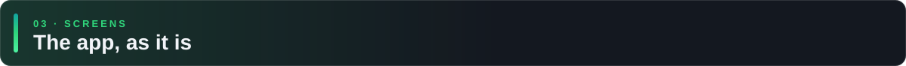

<table>
<tr>
<td width="50%"><br/><sub><b>Game Catalog</b> — every scanned title; Play where the system supports it, badges for what changed.</sub></td>
<td width="50%">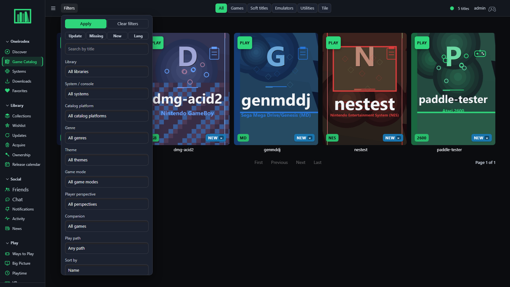<br/><sub><b>Filters</b> — library, system, genre, theme, companion, play path, sort; Update / Missing / New / Lang chips.</sub></td>
</tr>
<tr>
<td>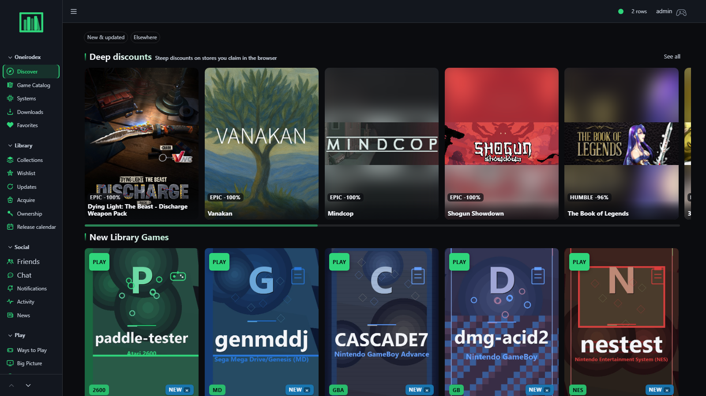<br/><sub><b>Discover</b> — the library as a storefront; shelves an admin orders, pins and hides per member.</sub></td>
<td>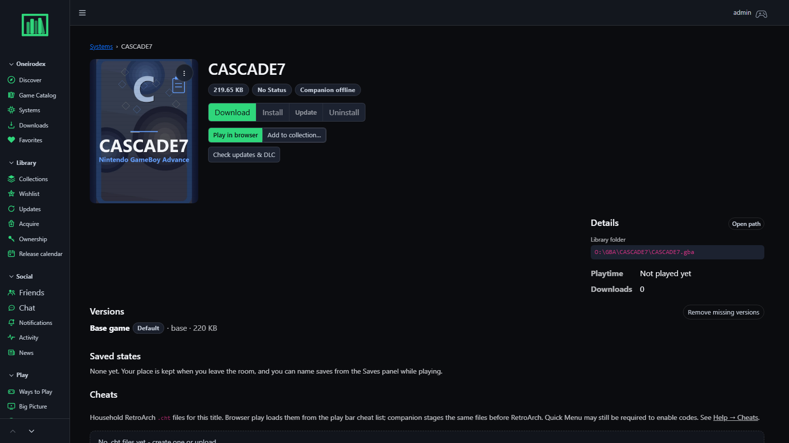<br/><sub><b>Game page</b> — Download, Install, Play in browser, collections, versions, saved states, cheats.</sub></td>
</tr>
<tr>
<td><br/><sub><b>Systems</b> — by console family, with the licensed catalog and ES-DE / Pegasus export packs.</sub></td>
<td>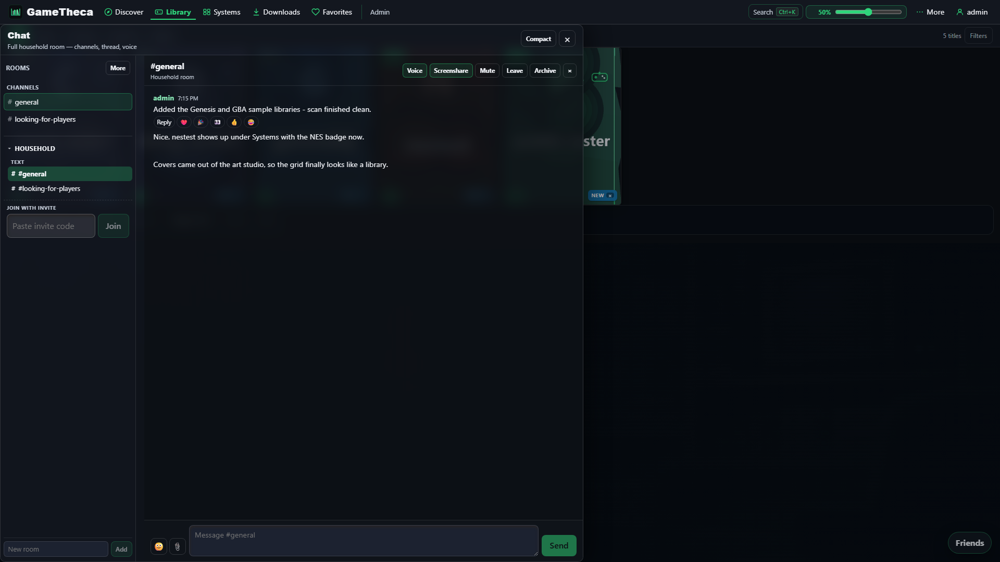<br/><sub><b>Chat</b> — rooms, spaces, threads, reactions; Voice and Screenshare when LiveKit is on.</sub></td>
</tr>
<tr>
<td>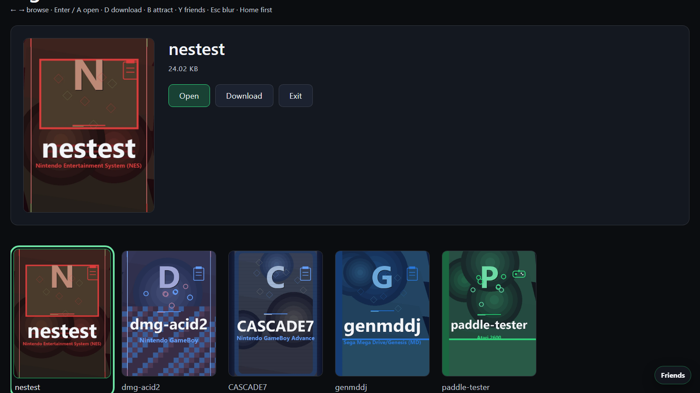<br/><sub><b>Big Picture</b> — the TV view: arrows browse, Enter opens, D downloads, Y friends, B attract mode.</sub></td>
<td>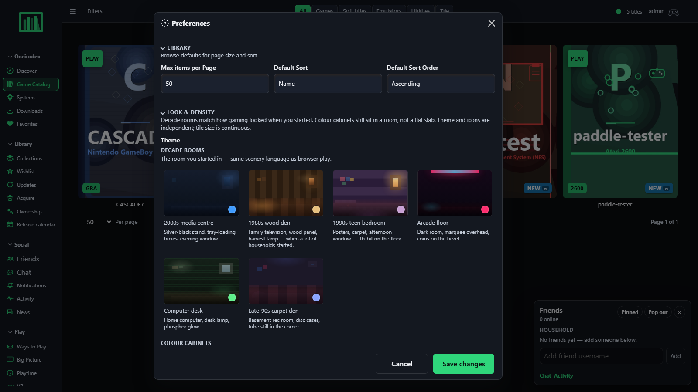<br/><sub><b>Preferences</b> — decade rooms, colour cabinets, icon packs, era fonts, tile size.</sub></td>
</tr>
<tr>
<td>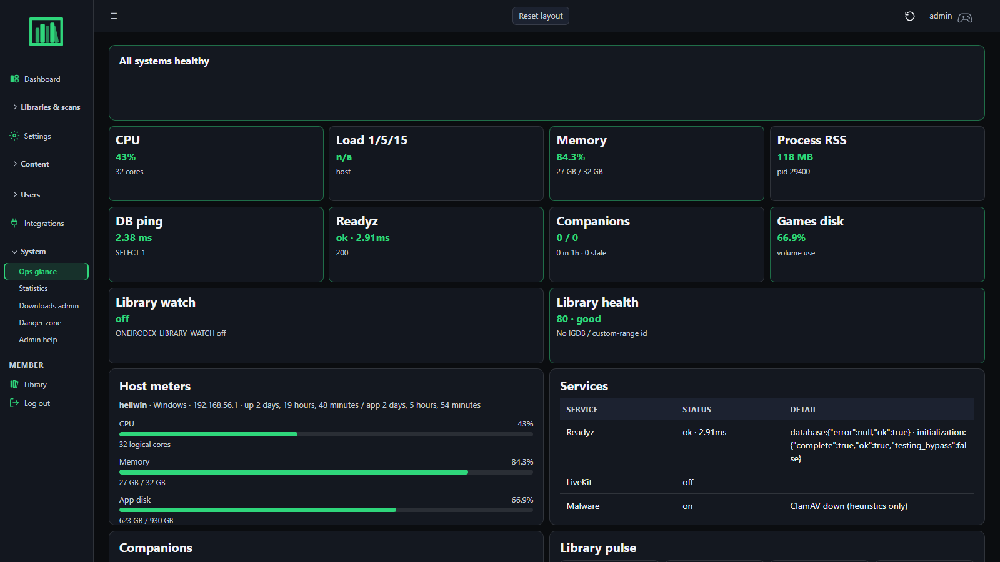<br/><sub><b>Admin · Ops</b> — services, queues, companions, watch folders, the log; same numbers on <code>/pulse</code>.</sub></td>
<td>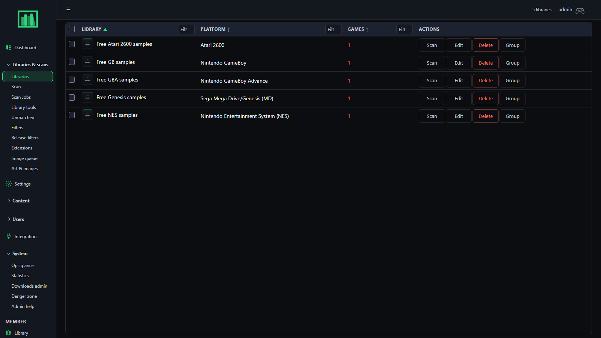<br/><sub><b>Admin · Libraries & scans</b> — platform + folder per library; scan, jobs, unmatched, filters.</sub></td>
</tr>
<tr>
<td>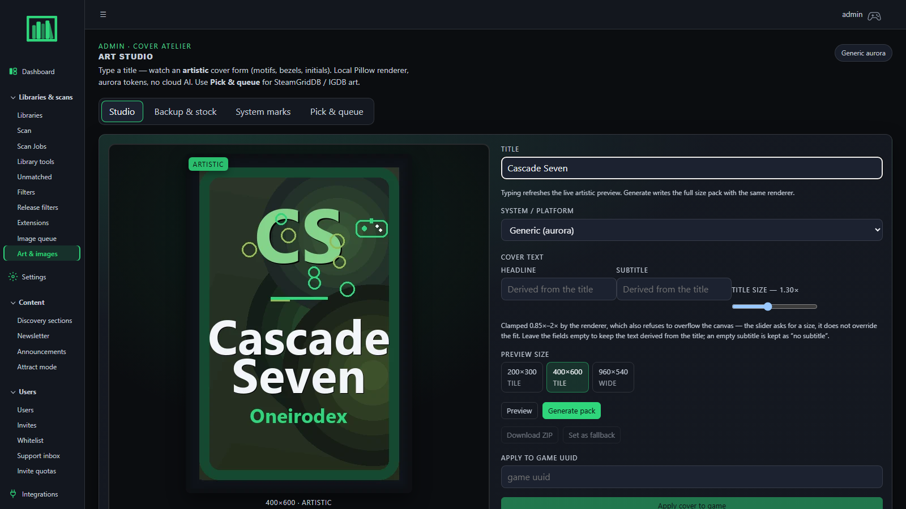<br/><sub><b>Admin · Art studio</b> — covers from a title with a local renderer; no cloud AI.</sub></td>
<td>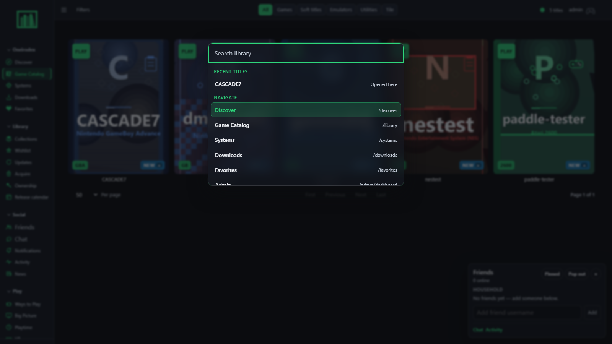<br/><sub><b>Command palette</b> — <kbd>Ctrl</kbd>/<kbd>⌘</kbd>+<kbd>K</kbd> from anywhere.</sub></td>
</tr>
</table>

More surfaces — friends dock, collections, calendar, news, help, every admin page — are in [`docs/media/screenshots/`](docs/media/screenshots/).

<details>
<summary>📷 How these are made</summary>

Stills are shot by [`scripts/capture_docs_media.py`](scripts/capture_docs_media.py) against a throwaway instance that [`scripts/serve_capture.py`](scripts/serve_capture.py) brings up — a scratch database, the five legal sample ROMs, covers from Art studio, a little chat history. Every shot passes a health gate (no error page, not empty, theme stylesheet actually loaded) or the file on disk is left alone. The banners and cards on this page are drawn by [`scripts/render_readme_art.py`](scripts/render_readme_art.py) from the theme tokens and the rail icons the app ships. Recipe: [CAPTURE.md](docs/assets/readme/CAPTURE.md).

</details>

<br/>

<a id="-how-to-videos"></a>
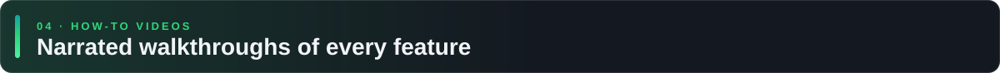

Short clips, one per feature, each a worked example with an **AI-voiced narration** timed to the screen, burned-in captions and a WebVTT track. Click a tile to open the clip on GitHub; the full index with transcripts is [docs/media/video/howto/README.md](docs/media/video/howto/README.md).

<table>
<tr>
<td><a href="docs/media/video/howto/howto-tour.mp4">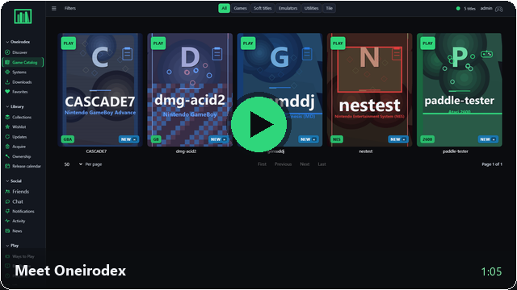</a></td>
<td><a href="docs/media/video/howto/howto-library.mp4">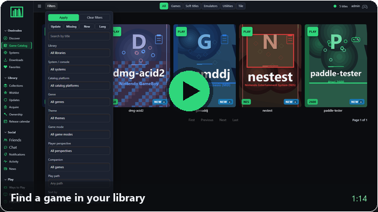</a></td>
<td><a href="docs/media/video/howto/howto-game-details.mp4">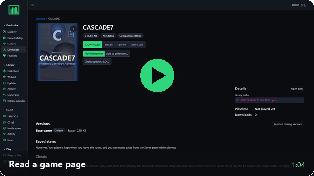</a></td>
</tr>
<tr>
<td><a href="docs/media/video/howto/howto-discover.mp4">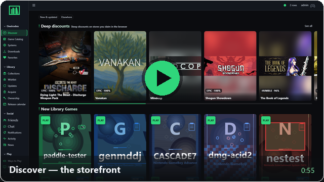</a></td>
<td><a href="docs/media/video/howto/howto-systems.mp4">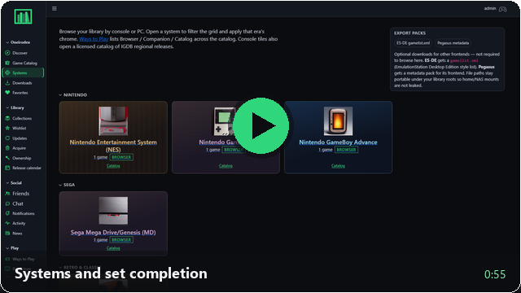</a></td>
<td><a href="docs/media/video/howto/howto-play.mp4">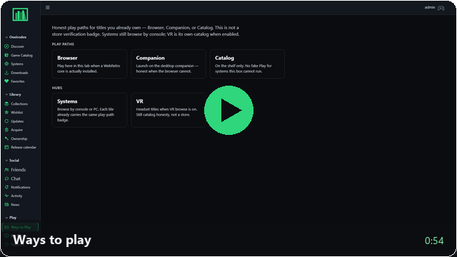</a></td>
</tr>
<tr>
<td><a href="docs/media/video/howto/howto-big-picture.mp4">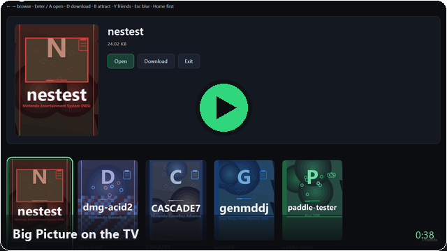</a></td>
<td><a href="docs/media/video/howto/howto-chat-spaces.mp4">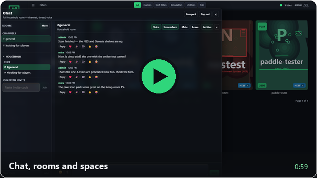</a></td>
<td><a href="docs/media/video/howto/howto-friends.mp4">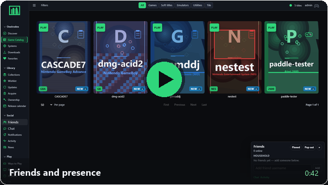</a></td>
</tr>
<tr>
<td><a href="docs/media/video/howto/howto-collections.mp4">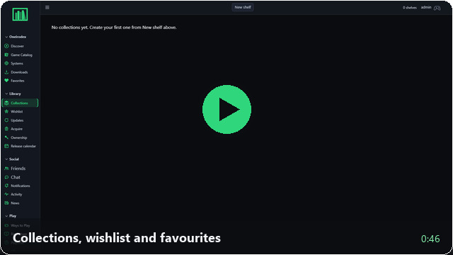</a></td>
<td><a href="docs/media/video/howto/howto-calendar-news.mp4">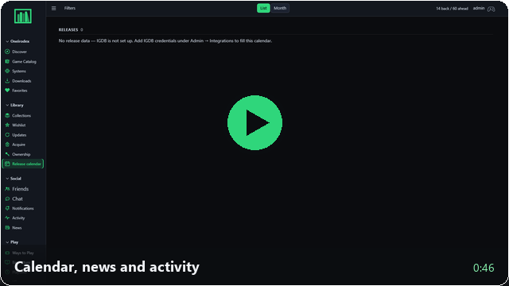</a></td>
<td><a href="docs/media/video/howto/howto-preferences.mp4">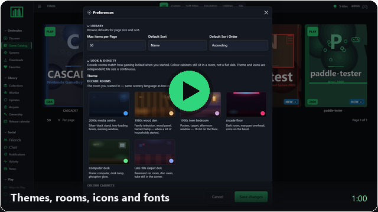</a></td>
</tr>
<tr>
<td><a href="docs/media/video/howto/howto-command-palette.mp4">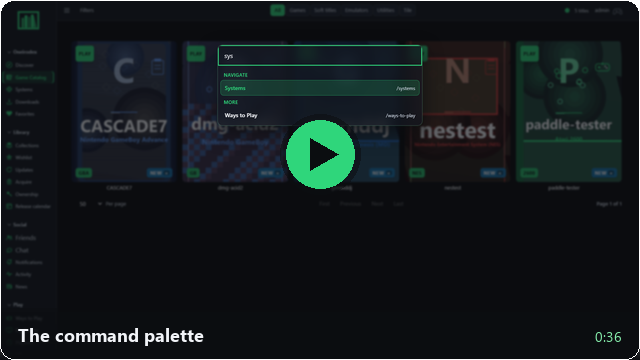</a></td>
<td><a href="docs/media/video/howto/howto-help-support.mp4">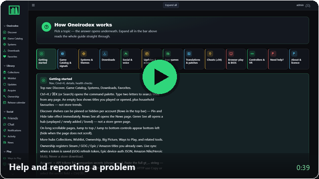</a></td>
<td><a href="docs/media/video/howto/howto-admin-libraries.mp4">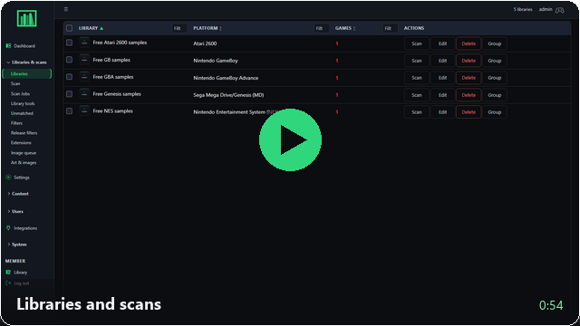</a></td>
</tr>
<tr>
<td><a href="docs/media/video/howto/howto-admin-discover.mp4">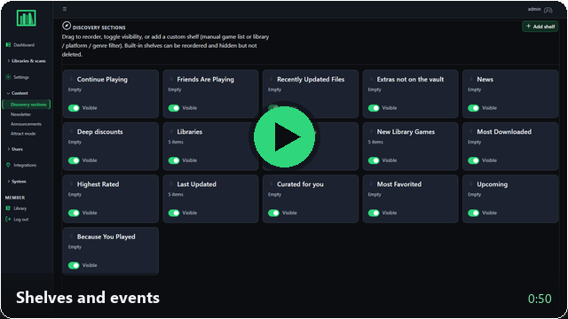</a></td>
<td><a href="docs/media/video/howto/howto-admin-ops.mp4">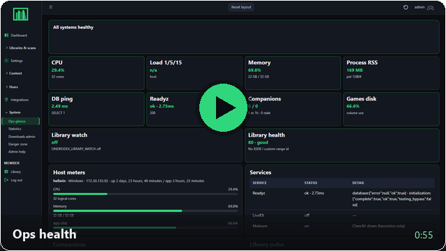</a></td>
<td><a href="docs/media/video/howto/howto-admin-users.mp4">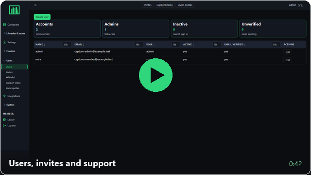</a></td>
</tr>
<tr>
<td><a href="docs/media/video/howto/howto-admin-settings.mp4">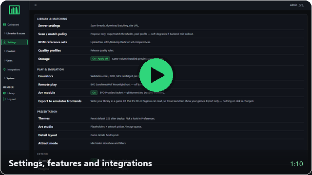</a></td>
<td><a href="docs/media/video/howto/howto-admin-art.mp4">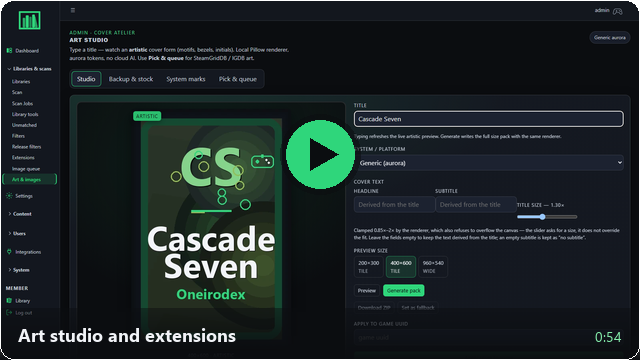</a></td>
<td></td>
</tr>
</table>

Recorded by [`scripts/capture_howto_videos.py`](scripts/capture_howto_videos.py): the script is the narration, each line is synthesised first and the recorder holds on a step for as long as the voice needs it. A section whose UI cannot do what it is about writes no file at all.

<br/>

<a id="-quick-start"></a>
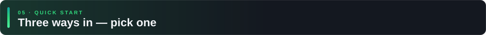

| | Best for | Guide |
|---|---|---|
| 🐳 **Docker Compose** | NAS, Unraid, anything already running Docker | [below](#-docker-compose) · [docker-compose-deploy.md](docs/runbooks/docker-compose-deploy.md) |
| 💻 **Native installer** | Bare-metal Linux · macOS · Windows | [below](#-native-installers) · [install-native.md](docs/runbooks/install-native.md) |
| 🔧 **Manual** | You want every step yourself | [below](#-manual-install) |

Whichever you choose, Oneirodex can scan **more than the disk it runs on** — see [scan locations](#-scan-locations).

<a id="-docker-compose"></a>
### 🐳 Docker Compose

```bash
cp .env.docker.example .env
# Unraid: prefer .env.unraid.example (Compose Manager paths + volume sectioning)
# Required: SECRET_KEY, DATA_FOLDER_GAMES (host games path), LIBRARY_HOST_PATH
# Do NOT use DATABASE_URL=@localhost — Compose talks to service "db"
docker compose up -d --build

# Optional household voice:
# ENABLE_LIVEKIT=true LIVEKIT_URL=ws://<lan-host>:7880 docker compose --profile livekit up -d

# Optional ClamAV daemon (heuristics run without it when ENABLE_MALWARE_SCAN=true):
# CLAMAV_HOST=clamav CLAMAV_PORT=3310 docker compose --profile clamav up -d
```

Open **http://localhost:5006** — Postgres is the `db` service; games mount at `/storage`.

| Deploy | Guide |
|---|---|
| 🏠 Unraid / NAS | [NAS-DEPLOY.md](NAS-DEPLOY.md) · [unraid-deploy.md](docs/runbooks/unraid-deploy.md) |
| 📂 NAS shares / extra disks | [remote-scan-locations.md](docs/runbooks/remote-scan-locations.md) |
| 🐳 Compose deep dive | [docker-compose-deploy.md](docs/runbooks/docker-compose-deploy.md) |
| 🔥 Won't start | [container-wont-start.md](docs/runbooks/container-wont-start.md) |

<a id="-native-installers"></a>
### 💻 Native installers

```bash
git clone --depth 1 https://github.com/chrisjrovira/oneirodex.git
cd oneirodex
```

<table>
<tr><th>🐧 Linux</th><th>🍎 macOS</th><th>🪟 Windows</th></tr>
<tr valign="top">
<td>

```bash
chmod +x install-linux.sh
./install-linux.sh
```

apt · dnf · yum · pacman · zypper

</td>
<td>

```bash
chmod +x install-macos.sh
./install-macos.sh
```

Homebrew (you install brew)

</td>
<td>

```powershell
.\install-windows.ps1
```

winget for Python · PostgreSQL

</td>
</tr>
</table>

Each one checks prerequisites, creates the database, builds a virtualenv and writes a `.env` with a generated `SECRET_KEY`.
Common flags — `--games-dir PATH` · `--library-roots 'NAS=/mnt/nas/roms'` · `--port 5006` · `--no-db` · `--dev` · `--force` · `--verbose` (Windows: `-GamesDir`, `-LibraryRoots`, `-Port`, `-SkipDb`, `-Dev`, `-Force`).

Start after installing: `./startweb.sh` — Windows: `.\startweb_windows.cmd`. Service units for boot / login start (systemd · launchd · Task Scheduler / NSSM) are in [install-native.md](docs/runbooks/install-native.md).

<a id="-manual-install"></a>
### 🔧 Manual install

1. PostgreSQL **17+** with a `oneirodex` database
2. Copy `.env.example` → `.env` — set `DATABASE_URL`, `SECRET_KEY`, `DATA_FOLDER_GAMES`, `UPLOAD_FOLDER`
3. `pip install -r requirements.txt`
4. `./startweb.sh` or `startweb_windows.cmd`

Force the setup wizard: `./startweb.sh --force-setup`. Full walkthrough, service units and upgrade notes: [install-native.md](docs/runbooks/install-native.md).

<br/>

<a id="-scan-locations"></a>
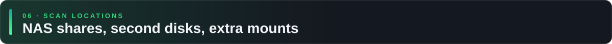

Oneirodex scans **any path the service can open** — a NAS share, a second internal disk, an external drive — once the host has mounted it. Two steps, in this order:

1. **Mount it** — `fstab` on Linux, autofs on macOS, a UNC path on Windows, a bind mount in Docker. Oneirodex does not speak SMB or NFS; the OS does.
2. **Declare it** — list the mount in `ONEIRODEX_LIBRARY_ROOTS` so the admin folder browser and the path allowlist know about it.

```bash
# Native: paths on this machine
ONEIRODEX_LIBRARY_ROOTS=NAS ROMs=/mnt/nas/roms|Archive=/mnt/archive/games

# Docker: paths as the CONTAINER sees them, one bind each in docker-compose.yml
ONEIRODEX_LIBRARY_ROOTS=NAS ROMs=/storage2|Archive=/storage3
```

Each location then shows up as a **Scan location** in Admin → Libraries & scans and gets its own row in Ops path health — so a share that stops being mounted reads as *not mounted* instead of as an empty library. Per-OS recipes, Docker binds, permissions and troubleshooting: **[remote-scan-locations.md](docs/runbooks/remote-scan-locations.md)**.

<br/>

<a id="-configuration"></a>
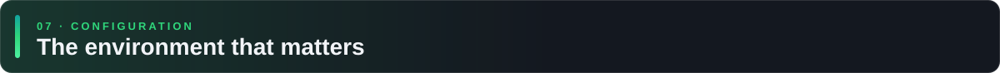

| Variable | Purpose |
|---|---|
| `DATABASE_URL` | Postgres URL (`db` host inside Compose) |
| `SECRET_KEY` | **Required** — the container refuses the placeholder |
| `DATA_FOLDER_GAMES` | Root of on-disk games — **required** (see the upgrade note below) |
| `ONEIRODEX_LIBRARY_ROOTS` | Extra scan locations — NAS shares, second disks. Pipe-separated, optional `Label=` prefix. Docker: the *container* path — [remote-scan-locations.md](docs/runbooks/remote-scan-locations.md) |
| `UPLOAD_FOLDER` | Covers / themes (Compose: `/app/oneirodex/static/library`) |
| `LIBRARY_HOST_PATH` | Host path mounted to `UPLOAD_FOLDER` in Docker |
| `ENABLE_LIVEKIT` / `LIVEKIT_*` | Household voice (on by default; needs secrets + profile) |
| `ENABLE_MALWARE_SCAN` / `MALWARE_SCAN_BLOCK_ON_HIT` / `CLAMAV_*` | Malware scanner — heuristics on by default; blocks / skips adds on hit; optional `--profile clamav` |
| `SUPPORT_GITHUB_TOKEN` / `SUPPORT_GITHUB_REPO` | Optional GitHub Issues sync for support tickets |
| `ENABLE_ARR_MODULE` · `ARR_REMOTE_PATH_MAP` | *arr search / qBittorrent (on); rewrite download-client paths when it runs in another container — `"/downloads=>/storage/downloads"` |
| `ENABLE_AI_ASSIST` / `ENABLE_AI_AUTO_APPLY` | Ollama triage (on); silent rename stays off |
| `ENABLE_VR_BROWSE` | `/vr` PWA catalog (on) |
| `OIDC_ENABLED` · `OIDC_LOCK_ROLES` | SSO — **off by default**; don't overwrite roles on every SSO login |
| `ALLOW_PRIVATE_LAN_URLS` | Allow *arr / Ollama on RFC1918 (on for a homelab) |
| `ENABLE_LOGIN_RATE_LIMIT` | In-process login / reset rate limit (on) |
| `ENABLE_PATCH_CATALOG` / `ENABLE_ROM_AI_TRANSLATE` | ROM patch / AI translate hooks (on) |
| `ENABLE_AI_ARTWORK` / `AI_ARTWORK_URL` / `AI_ARTWORK_ENGINE` | Generated cover art — **off by default**; your own A1111-compatible endpoint |
| `SCAN_CHECK_FRESHNESS` / `SCAN_FRESHNESS_LIMIT` | Check versions / updates / DLC after a scan — **off by default** (it is store HTTP traffic); cap 50 |
| `DAT_HASH_INNER_ARCHIVE` | Open zip / 7z / rar and hash the inner dump when the outer hash misses (on) |
| `FONT_PATH` / `FONT_MAX_BYTES` | Where theme fonts live (bundled faces are copied here on boot) and the per-file cap for uploads (8 MB) |

Full lists: [`.env.example`](.env.example) · [`.env.docker.example`](.env.docker.example) · [`.env.unraid.example`](.env.unraid.example) · [settings-modules.md](docs/admin/settings-modules.md)

> ⚠️ **Upgrading from ≤ 0.1.0:** `DATA_FOLDER_WAREZ` has been **removed**, including the Compose volume fallback that quietly used it. If your `.env` still sets only that key, the container starts with no games mounted at `/storage`. Rename it to `DATA_FOLDER_GAMES` before you redeploy.

<br/>

<a id="-architecture"></a>
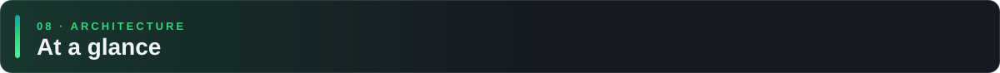

```text
┌─────────────────┐   ┌──────────────────┐   ┌────────────┐   ┌────────────┐
│  Member SPA     │   │  Admin SPA       │   │  Desktop   │   │  Quest PWA │
│  (React)        │   │  (React + Jinja) │   │  companion │   │  (/vr)     │
└────────┬────────┘   └────────┬─────────┘   └─────┬──────┘   └─────┬──────┘
         └─────────────┬───────┴───────────────────┴────────────────┘
                       ▼
              ┌─────────────────┐
              │  Flask on ASGI  │  ← oneirodex/  :5006
              │  APIs · auth    │
              └───────┬─────────┘
          ┌───────────┼────────────┐
          ▼           ▼            ▼
     PostgreSQL   Games volume   Optional LiveKit
```

| Layer | Location |
|---|---|
| Member UI | `frontend/member-app` → `/static/dist/member-app/` |
| Admin UI | `frontend/admin-app` → `/static/dist/admin-app/` |
| Ops glance | `frontend/ops-glance` |
| Typed client | `frontend/api-client` (`@oneirodex/api-client`, used by the desktop companion) |
| API / server | `oneirodex/` (routes split by surface: `routes_member.py`, `routes_admin_ext/`, `routes_apis/`) |
| Desktop / VR | `clients/desktop/` · `clients/quest/` |
| Docs | `docs/` — start at [docs/README.md](docs/README.md) |

<br/>

<a id="-troubleshooting"></a>
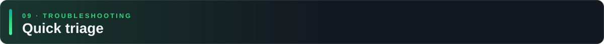

Full guides: [member](docs/user/troubleshooting.md) · [admin](docs/admin/troubleshooting.md) · [container won't start](docs/runbooks/container-wont-start.md)

**🚨 Container / boot**

| Symptom | Likely fix |
|---|---|
| Exit / restart loop + `SECRET_KEY` error | Set a real `SECRET_KEY` (not the placeholder) |
| Can't reach DB | Compose host must be `db`, not `localhost` |
| `no pg_hba.conf entry … no encryption` | Recreate db with the Compose `hba_file` mount — [container-wont-start §3b](docs/runbooks/container-wont-start.md#3b-postgres-up-but-pg_hba-rejects-app-no-encryption) |
| Port in use | Change the published `5006` mapping |
| Unstyled Library / Discover | Rebuild the image so the `member-app` dist exists |
| Discover stuck on Loading; logs show the stream but no `/api/discover/sections` | Rebuild the app with the ASGI SSE fix — [admin troubleshooting](docs/admin/troubleshooting.md#spa-navigates-but-pagesadmin-hang-discover-stuck-on-loading) |

```bash
docker compose logs app --tail 200
docker compose build --no-cache && docker compose up -d
```

**👤 Members**

| Symptom | What to try |
|---|---|
| Spin forever / blank UI | Hard refresh · re-login · ask an admin to check logs |
| Download 404 / empty zip | Admin: verify the games mount and re-scan |
| "Too many login attempts" | Wait a few minutes (rate limit) |
| Browser play won't start | System may be companion-only · missing BIOS |
| Chat empty | Ask an admin or librarian to create `#general` |
| Voice missing | LiveKit off, or `LIVEKIT_URL` not reachable from the **browser** |

**🛠️ Admins**

| Symptom | What to try |
|---|---|
| Scans stuck | [libraries-and-scans.md](docs/admin/libraries-and-scans.md) |
| Scan location shows "not mounted" | The share is not mounted, or Docker got the host path instead of the container path — [remote-scan-locations.md](docs/runbooks/remote-scan-locations.md#troubleshooting) |
| Support not on GitHub | Expected without `SUPPORT_GITHUB_TOKEN` — the inbox still works |
| SSO fails | Env `OIDC_ENABLED` **and** Admin → Integrations |
| Themes look wrong after upgrade | [themes-reset.md](docs/admin/themes-reset.md) |
| Picking a theme changes nothing on reload | Fixed — a server from before that fix bakes the first render's theme into every later one ([troubleshooting](docs/user/troubleshooting.md#a-new-theme-doesnt-appear-after-reload)) |

Still stuck? **More → Report issue** (members) or open a GitHub issue with deploy type, URL and redacted logs.

<br/>

<a id="-documentation"></a>
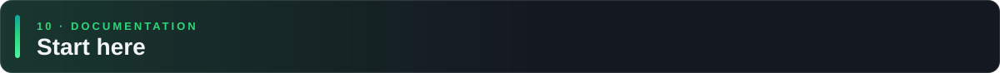

| Audience | Start here |
|---|---|
| 👋 Members | [Getting started](docs/user/getting-started.md) · [FAQ](docs/user/faq.md) · [Troubleshooting](docs/user/troubleshooting.md) |
| 🎮 Play | [Browser play](docs/user/browser-play.md) · [Desktop companion](docs/user/desktop-companion.md) · [Free games](docs/user/free-games.md) |
| 💬 Social | [Social & voice](docs/user/social-and-voice.md) · [Spaces](docs/user/social-and-voice.md#spaces-servers-with-their-own-channels) |
| 🗂️ Library | [Library & systems](docs/user/library-and-systems.md) · [Translation patches](docs/user/translation-patches.md) |
| 🎨 Look & feel | [Preferences & themes](docs/user/preferences-themes.md) · [Fonts & image uploads](docs/admin/theme-fonts-and-images.md) |
| 🎬 Videos | [How-to index with transcripts](docs/media/video/howto/README.md) |
| 🛡️ Admins | [Libraries & scans](docs/admin/libraries-and-scans.md) · [Discover sections](docs/admin/discover-sections.md) · [Support inbox](docs/admin/support-inbox.md) · [Settings modules](docs/admin/settings-modules.md) · [Ops summary](docs/admin/ops-summary.md) |
| 🚢 Operators | [Native install](docs/runbooks/install-native.md) · [Scan locations](docs/runbooks/remote-scan-locations.md) · [Unraid](docs/runbooks/unraid-deploy.md) · [Compose](docs/runbooks/docker-compose-deploy.md) · [LiveKit](docs/runbooks/livekit-unraid.md) · [OIDC](docs/runbooks/oidc-sso.md) · [WebRetro cores](docs/runbooks/webretro-cores.md) · [Emulator BIOS](docs/runbooks/emulator-bios.md) · [Reference sets](docs/runbooks/reference-sets.md) · [Building installers](docs/runbooks/local-installers.md) |
| 🗺️ Changelog | [CHANGELOG.md](CHANGELOG.md) · [Docs index](docs/README.md) |
| 🔌 API | [openapi.json](docs/openapi/openapi.json) |

<br/>

<a id="-development"></a>


```bash
# requirements-dev.txt pulls in requirements.txt and adds the pinned test runner.
pip install -r requirements-dev.txt

# Front ends — one npm workspace at the repo root
npm ci
(cd frontend/api-client && npm run build)
(cd frontend/member-app && npm test && npm run build)
(cd frontend/admin-app  && npm test && npm run build)

# Backend smoke
pytest tests/test_security_suite.py tests/test_set_completion.py tests/test_login_rate_limit.py -q

# Ratchets — never regress
python scripts/api_envelope_lint.py
node scripts/css-token-lint.mjs
```

Set `TEST_DATABASE_URL` (the DB name must contain `test`, default `oneirodextest`) for DB-backed tests — [local-postgres-pytest.md](docs/runbooks/local-postgres-pytest.md). Conventions, locks and agent seats: [CONTRIBUTING.md](CONTRIBUTING.md) · [docs/dev/](docs/dev/).

**Versioning.** The product version is tracked in [`VERSION`](VERSION); desktop, member-app and related packages follow the same milestone number. See [CHANGELOG.md](CHANGELOG.md).

<br/>

<a id="-license"></a>
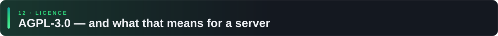

Oneirodex is licensed under the **[GNU Affero General Public License v3.0](LICENSE)**.

In practice: you may run, study, modify and share it freely, and if you run a modified version **as a network service** you must offer those modifications to its users (AGPL §13). That clause is the reason for AGPL over GPL here — this is a server people host for others.

```
Copyright (C) 2026 Oneirodex contributors

This program is free software: you can redistribute it and/or modify it under
the terms of the GNU Affero General Public License as published by the Free
Software Foundation, either version 3 of the License, or (at your option) any
later version. It is distributed WITHOUT ANY WARRANTY; without even the implied
warranty of MERCHANTABILITY or FITNESS FOR A PARTICULAR PURPOSE. See the GNU
Affero General Public License for more details.
```

**Running a modified copy? Set `ONEIRODEX_SOURCE_URL` to your fork.** The app surfaces a "Get the source code" link on member **Help** and in the admin footer — that is how §13 is actually discharged. It defaults to this repository, which is wrong the moment you modify anything, because §13 obliges you to offer *your* users *your* source.

**Content is separate from code.** The licence covers Oneirodex itself. It says nothing about the games, ROMs, BIOS or artwork you point it at — use Oneirodex only with software you are authorised to share.

**Third-party code.** The browser libraries under `oneirodex/static/vendor/` are separate works under their own licences — inventory in [THIRD-PARTY-NOTICES.md](oneirodex/static/vendor/THIRD-PARTY-NOTICES.md). The libretro emulator cores are **not** distributed here: they carry GPL and non-commercial terms, so they are fetched onto your machine at first boot ([webretro-cores.md](docs/runbooks/webretro-cores.md)).

---

<p align="center">
  
  <br/>
  <sub>Built for households that keep their own libraries.</sub>
</p>
