# How-to videos

One short narrated clip per feature, each a **worked example**: open the
thing, use it, show the result. An AI voice (Microsoft neural, via
`edge-tts`) reads a script that is timed to what is on screen; the same lines
are burned in as a lower-third caption and shipped as a WebVTT track next to
each file, so the clips work with sound off and with a screen reader's
transcript.

Recorded by [`scripts/capture_howto_videos.py`](../../../../scripts/capture_howto_videos.py)
against a local capture instance ([`scripts/serve_capture.py`](../../../../scripts/serve_capture.py))
— see [CAPTURE.md](../../../assets/readme/CAPTURE.md). The prose guides say
*why*; the clip shows *where*.

> GitHub plays `.mp4` files in place: click a poster to open the file page.

## Overview and members

| | Video | Shows | Guide |
|---|---|---|---|
| <a href="howto-tour.mp4">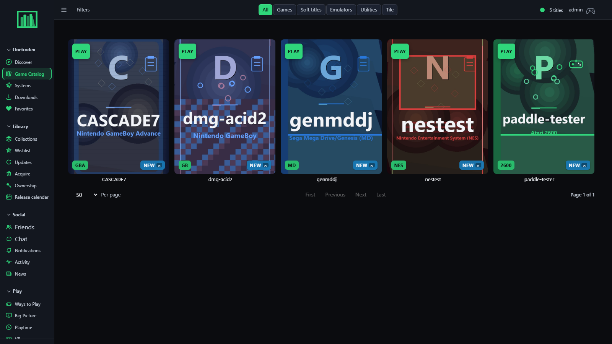</a> | [`howto-tour.mp4`](howto-tour.mp4) · 65s | **Meet Oneirodex** — A quick lap of the member app — Discover, the catalog, Systems, and the household. | [getting-started.md](../../../../docs/user/getting-started.md) |
| <a href="howto-library.mp4">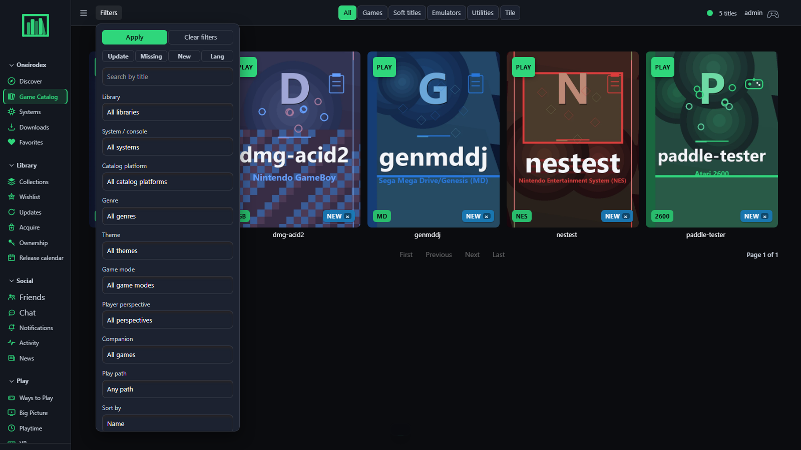</a> | [`howto-library.mp4`](howto-library.mp4) · 74s | **Find a game in your library** — Filters, segments, tile size and the actions on a tile. | [library-and-systems.md](../../../../docs/user/library-and-systems.md) |
| <a href="howto-game-details.mp4">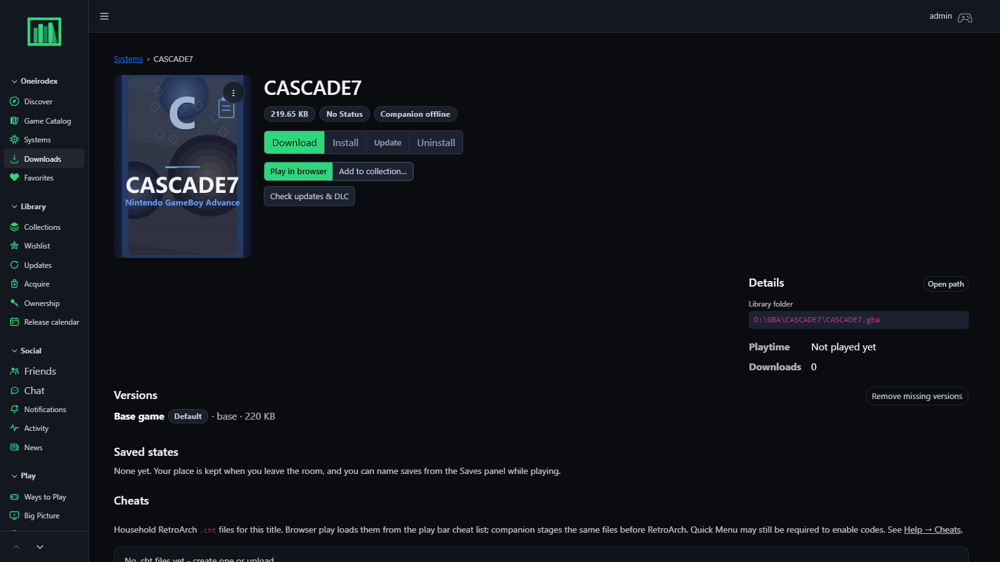</a> | [`howto-game-details.mp4`](howto-game-details.mp4) · 64s | **Read a game page** — Download, play, install, versions, saved states and cheats — in one place. | [library-and-systems.md](../../../../docs/user/library-and-systems.md) |
| <a href="howto-discover.mp4">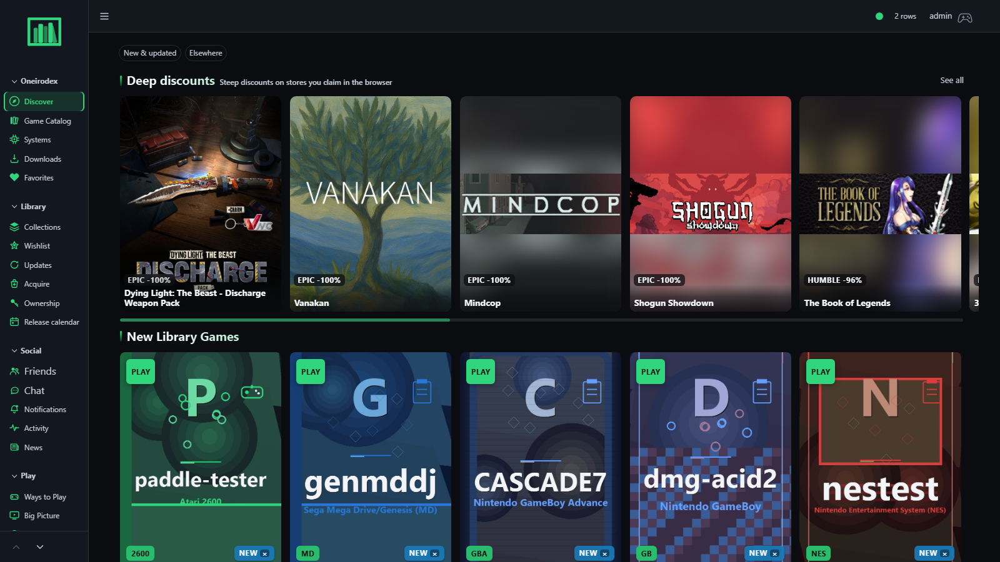</a> | [`howto-discover.mp4`](howto-discover.mp4) · 55s | **Discover — the storefront** — Shelves, zones, pin and hide, and See all. | [library-and-systems.md](../../../../docs/user/library-and-systems.md) |
| <a href="howto-systems.mp4">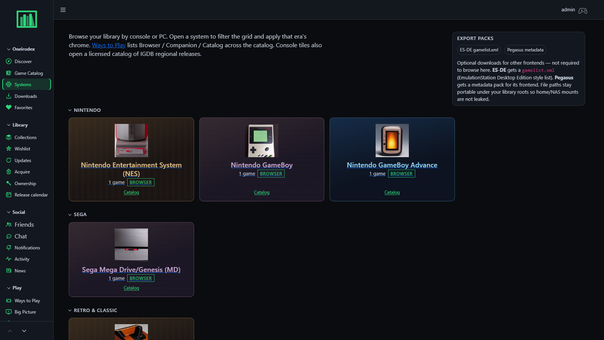</a> | [`howto-systems.mp4`](howto-systems.mp4) · 55s | **Systems and set completion** — Console families, the licensed catalog, export packs and DAT completion. | [library-and-systems.md](../../../../docs/user/library-and-systems.md) |
| <a href="howto-play.mp4">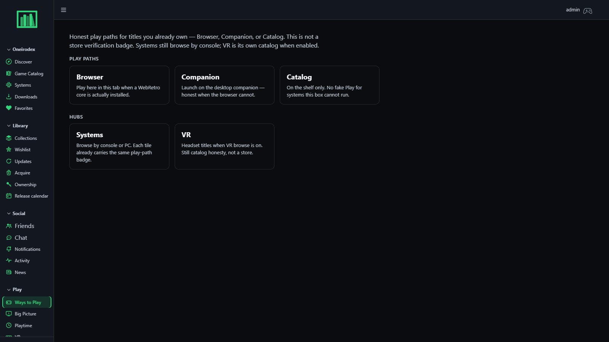</a> | [`howto-play.mp4`](howto-play.mp4) · 54s | **Ways to play** — Browser play, the desktop companion, and Big Picture for the TV. | [browser-play.md](../../../../docs/user/browser-play.md) |
| <a href="howto-big-picture.mp4">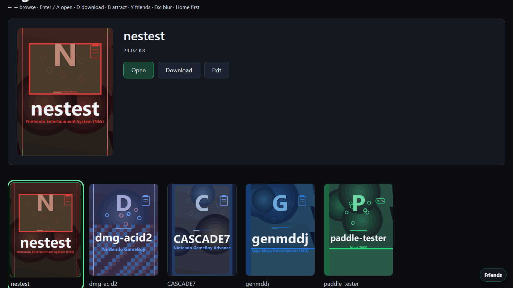</a> | [`howto-big-picture.mp4`](howto-big-picture.mp4) · 38s | **Big Picture on the TV** — A ten-foot interface driven by a controller or a few keys. | [browser-play.md](../../../../docs/user/browser-play.md) |
| <a href="howto-chat-spaces.mp4">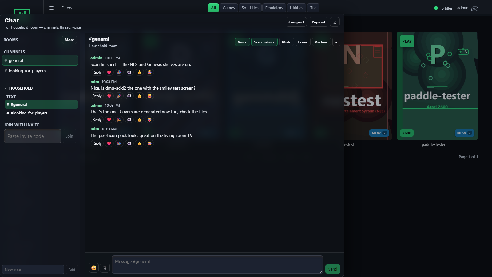</a> | [`howto-chat-spaces.mp4`](howto-chat-spaces.mp4) · 59s | **Chat, rooms and spaces** — Household rooms, reactions and threads, voice, and invite-only spaces. | [social-and-voice.md](../../../../docs/user/social-and-voice.md) |
| <a href="howto-friends.mp4">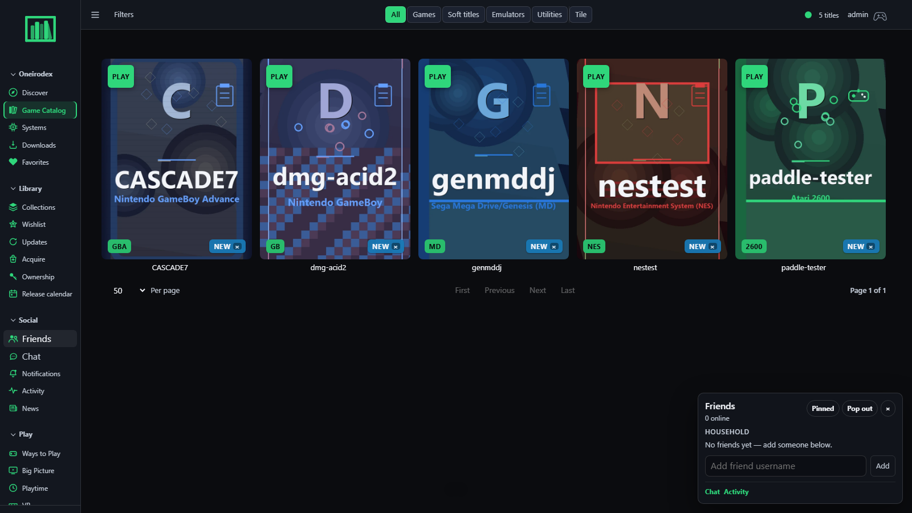</a> | [`howto-friends.mp4`](howto-friends.mp4) · 42s | **Friends and presence** — The friends dock, adding people, and the pop-out companion. | [social-and-voice.md](../../../../docs/user/social-and-voice.md) |
| <a href="howto-collections.mp4">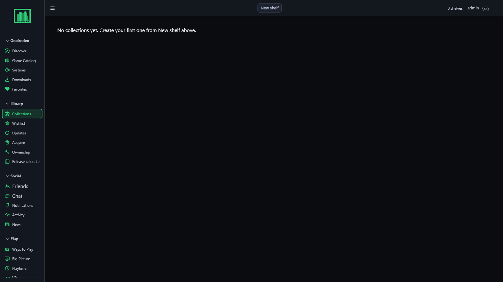</a> | [`howto-collections.mp4`](howto-collections.mp4) · 46s | **Collections, wishlist and favourites** — The lists that organise a library — and Downloads for what you took. | [library-and-systems.md](../../../../docs/user/library-and-systems.md) |
| <a href="howto-calendar-news.mp4">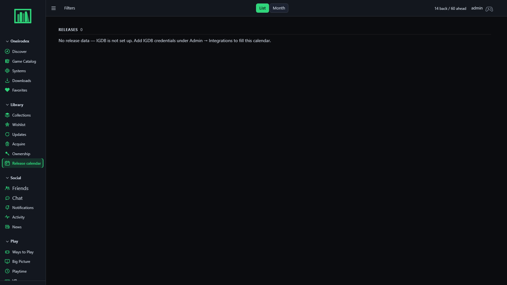</a> | [`howto-calendar-news.mp4`](howto-calendar-news.mp4) · 46s | **Calendar, news and activity** — What is coming, what happened, and what the household did. | [library-and-systems.md](../../../../docs/user/library-and-systems.md) |
| <a href="howto-preferences.mp4">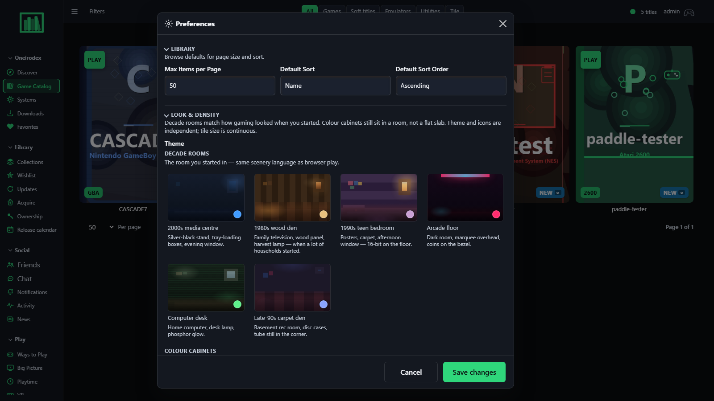</a> | [`howto-preferences.mp4`](howto-preferences.mp4) · 60s | **Themes, rooms, icons and fonts** — Make it yours from the Preferences modal. | [preferences-themes.md](../../../../docs/user/preferences-themes.md) |
| <a href="howto-command-palette.mp4">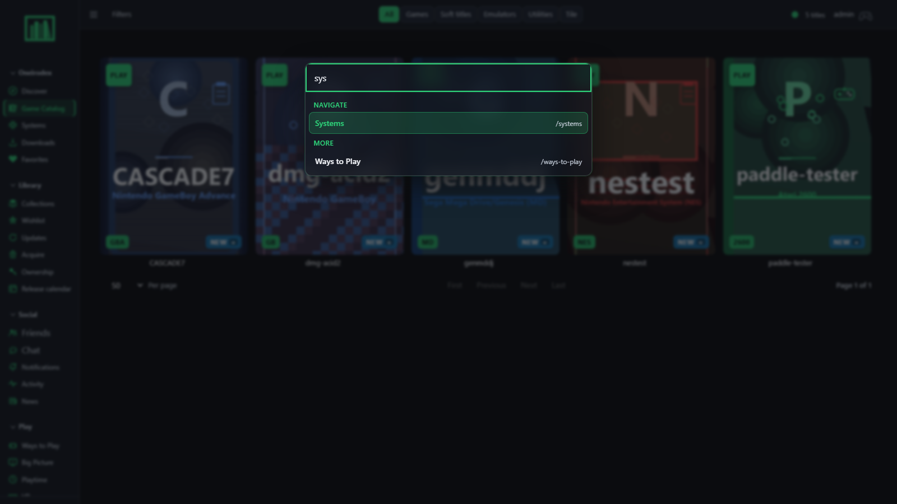</a> | [`howto-command-palette.mp4`](howto-command-palette.mp4) · 36s | **The command palette** — Ctrl-K or Cmd-K to search titles and jump anywhere. | [getting-started.md](../../../../docs/user/getting-started.md) |
| <a href="howto-help-support.mp4">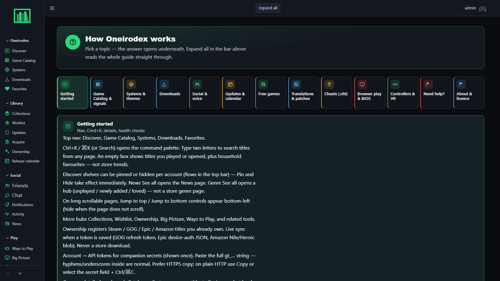</a> | [`howto-help-support.mp4`](howto-help-support.mp4) · 39s | **Help and reporting a problem** — The in-app guide, and Report issue straight to the admin inbox. | [faq.md](../../../../docs/user/faq.md) |

## Admins

| | Video | Shows | Guide |
|---|---|---|---|
| <a href="howto-admin-libraries.mp4">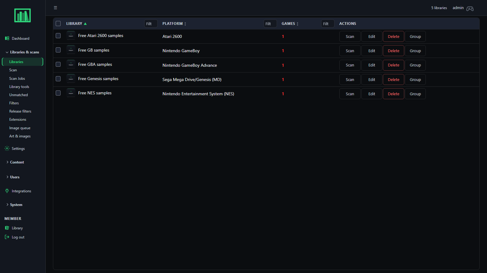</a> | [`howto-admin-libraries.mp4`](howto-admin-libraries.mp4) · 54s | **Libraries and scans** — Add a library, point a scan at a folder, watch the job. | [libraries-and-scans.md](../../../../docs/admin/libraries-and-scans.md) |
| <a href="howto-admin-discover.mp4">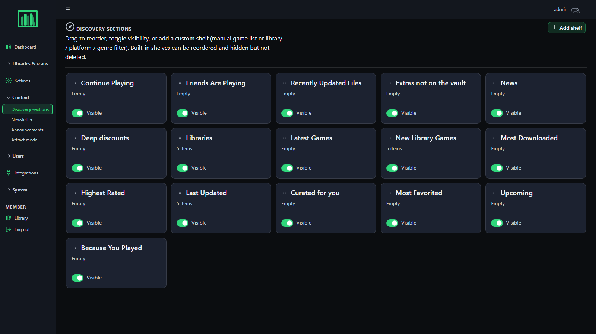</a> | [`howto-admin-discover.mp4`](howto-admin-discover.mp4) · 50s | **Shelves and events** — Arrange Discover: reorder, hide, and add custom shelves with dates. | [discover-sections.md](../../../../docs/admin/discover-sections.md) |
| <a href="howto-admin-ops.mp4">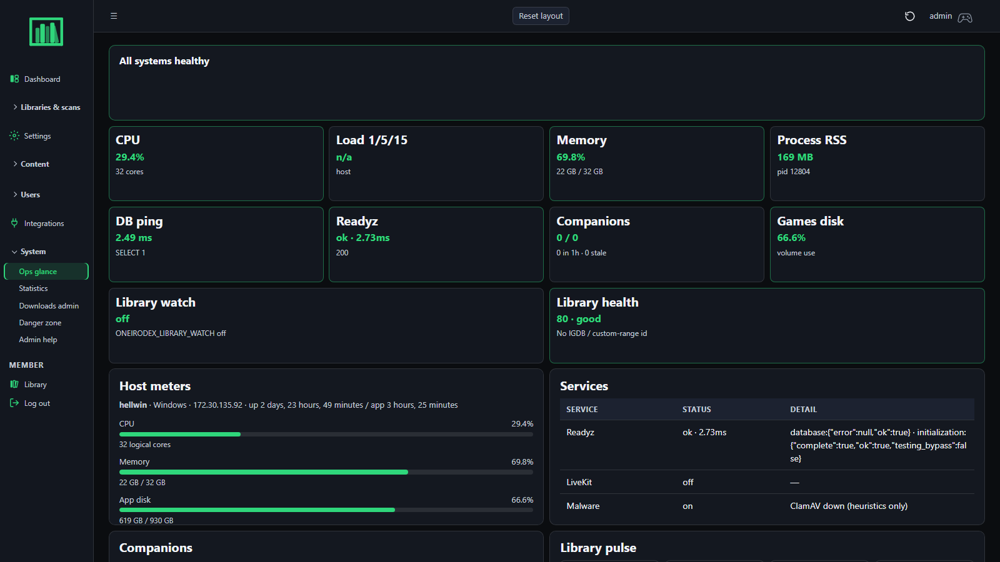</a> | [`howto-admin-ops.mp4`](howto-admin-ops.mp4) · 55s | **Ops health** — Is everything healthy — services, queues, companions, the log. | [ops-summary.md](../../../../docs/admin/ops-summary.md) |
| <a href="howto-admin-users.mp4">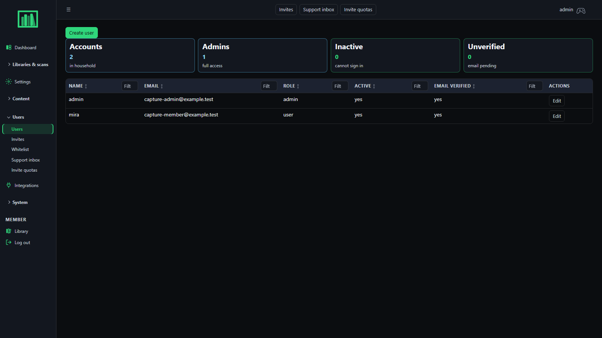</a> | [`howto-admin-users.mp4`](howto-admin-users.mp4) · 42s | **Users, invites and support** — Household membership, invite links, roles and the support inbox. | [support-inbox.md](../../../../docs/admin/support-inbox.md) |
| <a href="howto-admin-settings.mp4">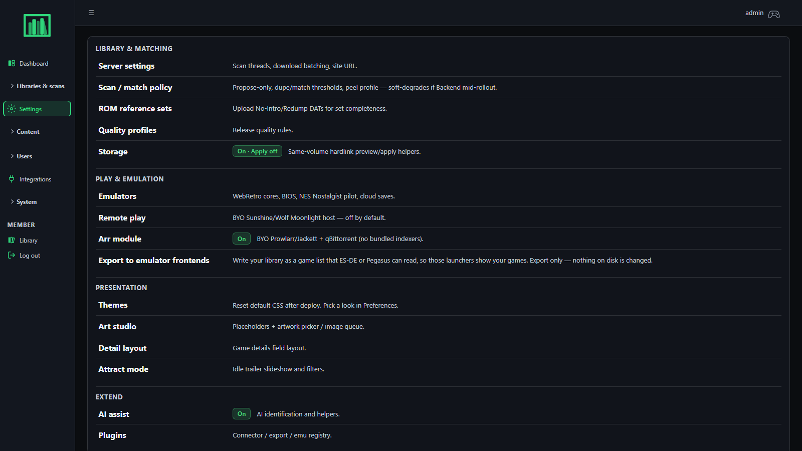</a> | [`howto-admin-settings.mp4`](howto-admin-settings.mp4) · 70s | **Settings, features and integrations** — Server settings, module toggles, metadata providers, SSO. | [settings-modules.md](../../../../docs/admin/settings-modules.md) |
| <a href="howto-admin-art.mp4">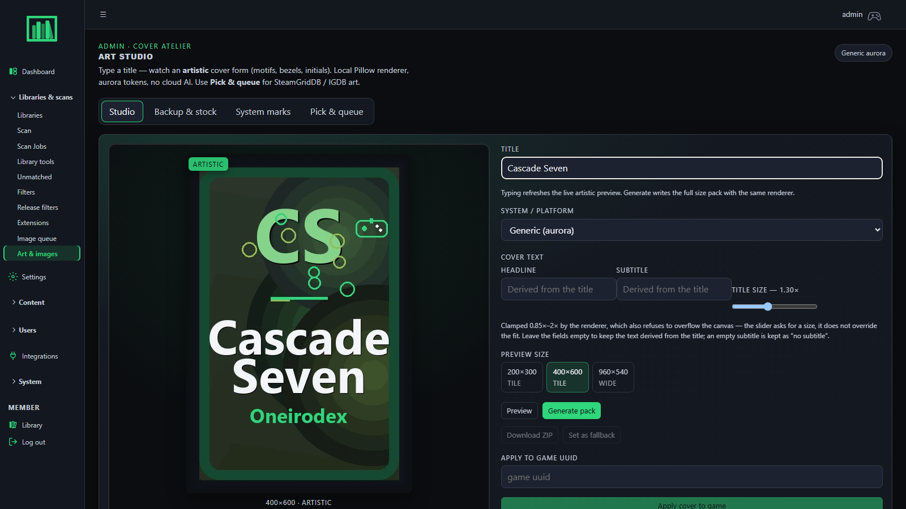</a> | [`howto-admin-art.mp4`](howto-admin-art.mp4) · 54s | **Art studio and extensions** — Covers without a cloud, the image queue, and reference sets. | [theme-fonts-and-images.md](../../../../docs/admin/theme-fonts-and-images.md) |

## Transcripts

Every line the voice says, in order — the same text as the `.vtt` tracks.

<details>
<summary><strong>Meet Oneirodex</strong> — transcript</summary>

1. Meet Oneirodex. A quick lap of the member app — Discover, the catalog, Systems, and the household.
2. Oneirodex is a self-hosted game library for a household. This is the member app, and Discover is where it opens.
3. Shelves surface what is new, what friends are playing, store deals, and curated rows an admin arranges.
4. Game Catalog is the whole library — every scanned title, with filters, badges and play buttons on each tile.
5. Systems groups the same library by console family, with a licensed catalog behind each console.
6. Chat, Friends and Notifications make it a household rather than a file share.
7. And everything you just saw is one Ctrl-K away from anywhere.
8. The rest of these clips take each of those areas one at a time.
9. That is meet oneirodex. The written guide is in the docs folder, at docs/user/getting-started.md.

</details>

<details>
<summary><strong>Find a game in your library</strong> — transcript</summary>

1. Find a game in your library. Filters, segments, tile size and the actions on a tile.
2. Game Catalog lists every title Oneirodex has scanned and identified.
3. The segments across the top split games from soft titles, emulators and utilities.
4. Back to All.
5. Filters opens the full set — library, system, genre, theme, play path, and sort. Update, Missing, New and Lang are one-tap chips.
6. Type part of a name to narrow the grid as you go.
7. Clear it, and close the panel.
8. Every tile carries a Play button when browser play is available, a system chip, and a freshness badge — NEW here, UPDATE or MISSING after later scans.
9. The heart marks a favourite, and the menu holds download, collection and status actions.
10. Close the menu, then open a title to read its page.
11. That is find a game in your library. The written guide is in the docs folder, at docs/user/library-and-systems.md.

</details>

<details>
<summary><strong>Read a game page</strong> — transcript</summary>

1. Read a game page. Download, play, install, versions, saved states and cheats — in one place.
2. Open any tile and you land on the game page.
3. The header has the cover, size and status chips, and the actions: Download the files, Install through the desktop companion, or Play in browser where the system supports it.
4. Add to collection keeps household lists; Check updates and DLC asks the store side for newer versions.
5. Details on the right shows the library folder and playtime. Open path hands the folder to the desktop companion.
6. Versions lists the base game and every extra Oneirodex has matched.
7. Saved states and household cheat files live here too — browser play and the companion both read the same ones.
8. That is read a game page. The written guide is in the docs folder, at docs/user/library-and-systems.md.

</details>

<details>
<summary><strong>Discover — the storefront</strong> — transcript</summary>

1. Discover — the storefront. Shelves, zones, pin and hide, and See all.
2. Discover is Oneirodex as a storefront for your own library.
3. Each row is a shelf. New Library Games, Most Downloaded, Curated for you — an admin orders them and can add custom ones with dates.
4. Pin keeps a shelf at the top for you; Hide removes it for your account only.
5. Arrows scroll a shelf, and See all opens it as a full page.
6. Zones at the top are curated views — New and updated, and Elsewhere for titles outside the vault.
7. Everything here is your library, arranged — never a store queue.
8. That is discover — the storefront. The written guide is in the docs folder, at docs/user/library-and-systems.md.

</details>

<details>
<summary><strong>Systems and set completion</strong> — transcript</summary>

1. Systems and set completion. Console families, the licensed catalog, export packs and DAT completion.
2. Systems is the same library grouped by console family.
3. Each console tile shows how many games you hold, whether they run in the browser, and a Catalog link to the licensed release list.
4. Export packs write a gamelist for ES-DE or Pegasus, so other front ends can show the same library without moving a file.
5. Completion compares your ROM sets against No-Intro and Redump DATs an admin uploads.
6. Region chips and percentages tell you exactly what is missing per system.
7. That is systems and set completion. The written guide is in the docs folder, at docs/user/library-and-systems.md.

</details>

<details>
<summary><strong>Ways to play</strong> — transcript</summary>

1. Ways to play. Browser play, the desktop companion, and Big Picture for the TV.
2. Ways to Play lists every path to actually running a game.
3. Browser play uses WebRetro for supported consoles — cores are fetched at first boot, and cloud saves and cheats ride along.
4. The desktop companion installs, launches and updates PC titles; Catalog is browse-only.
5. On a tile, Play opens the game straight in a new tab.
6. Play buttons appear only where the system, the core and any BIOS are actually ready — no fake Play buttons.
7. Playtime keeps the record of what you ran and for how long.
8. That is ways to play. The written guide is in the docs folder, at docs/user/browser-play.md.

</details>

<details>
<summary><strong>Big Picture on the TV</strong> — transcript</summary>

1. Big Picture on the TV. A ten-foot interface driven by a controller or a few keys.
2. Big Picture is the living-room view — large tiles, one focused title, controller-friendly.
3. Left and right browse.
4. Enter or A opens, D downloads, Y brings up friends, and B starts attract mode.
5. Escape blurs the focus and Home returns to the first tile.
6. That is big picture on the tv. The written guide is in the docs folder, at docs/user/browser-play.md.

</details>

<details>
<summary><strong>Chat, rooms and spaces</strong> — transcript</summary>

1. Chat, rooms and spaces. Household rooms, reactions and threads, voice, and invite-only spaces.
2. Chat slides out over whatever you are doing.
3. Expand gives it the whole pane.
4. Rooms are household channels — general, looking for players, whatever you add.
5. Messages take reactions, replies and threads.
6. Voice and Screenshare open a LiveKit session for the room when an admin has enabled it.
7. Switch to another room.
8. Spaces are servers of their own — text and voice channels, household-wide or invite-only. Paste an invite code to join one.
9. Pop out opens chat as its own window, handy on a second screen.
10. That is chat, rooms and spaces. The written guide is in the docs folder, at docs/user/social-and-voice.md.

</details>

<details>
<summary><strong>Friends and presence</strong> — transcript</summary>

1. Friends and presence. The friends dock, adding people, and the pop-out companion.
2. Friends is a dock, not a page — it opens from the rail and stays put.
3. It shows who in the household is online and what they are playing.
4. Add someone by username.
5. Pinned keeps the dock open across pages; Pop out makes it an always-on-top window with the desktop companion.
6. Chat and Activity jump straight to those surfaces.
7. That is friends and presence. The written guide is in the docs folder, at docs/user/social-and-voice.md.

</details>

<details>
<summary><strong>Collections, wishlist and favourites</strong> — transcript</summary>

1. Collections, wishlist and favourites. The lists that organise a library — and Downloads for what you took.
2. Collections are named lists you build from any game page or tile menu.
3. Wishlist tracks titles you want — the release calendar and store deals feed it.
4. Favourites is the heart on a tile, collected.
5. Downloads lists what you have taken from the library and the zips still being built.
6. Updates is the inbox for new versions and extras that scans find for titles you hold.
7. That is collections, wishlist and favourites. The written guide is in the docs folder, at docs/user/library-and-systems.md.

</details>

<details>
<summary><strong>Calendar, news and activity</strong> — transcript</summary>

1. Calendar, news and activity. What is coming, what happened, and what the household did.
2. Release calendar is IGDB's schedule, filtered to what you own or wish for. List or Month view.
3. Month lays the same releases on a grid.
4. News collects store and publisher feeds an admin has turned on.
5. Activity is the household timeline — scans, downloads, plays and posts.
6. Notifications are yours alone: mentions, invites, finished scans.
7. That is calendar, news and activity. The written guide is in the docs folder, at docs/user/library-and-systems.md.

</details>

<details>
<summary><strong>Themes, rooms, icons and fonts</strong> — transcript</summary>

1. Themes, rooms, icons and fonts. Make it yours from the Preferences modal.
2. Preferences lives under the account menu.
3. Library sets your page size and default sort.
4. Decade rooms are the scenery — a 1980s wood den, a 90s bedroom, an arcade floor. Browser play uses the same room.
5. Colour cabinets are palettes that still sit in a room rather than a flat colour.
6. Icon packs are independent of the theme — Outline, Filled, Duotone, Pixel, Soft and Mono.
7. Fonts offer era faces per system; tile size is a continuous slider.
8. Save, and the whole app takes the new look.
9. That is themes, rooms, icons and fonts. The written guide is in the docs folder, at docs/user/preferences-themes.md.

</details>

<details>
<summary><strong>The command palette</strong> — transcript</summary>

1. The command palette. Ctrl-K or Cmd-K to search titles and jump anywhere.
2. From any page, press Control K.
3. Empty, it lists everywhere you can go — and, once you have played something, your recent titles and household favourites.
4. Type two letters to search titles and destinations.
5. Enter goes there.
6. That is the command palette. The written guide is in the docs folder, at docs/user/getting-started.md.

</details>

<details>
<summary><strong>Help and reporting a problem</strong> — transcript</summary>

1. Help and reporting a problem. The in-app guide, and Report issue straight to the admin inbox.
2. Help is the in-app guide — pick a topic and the answer opens underneath.
3. Expand all reads it straight through.
4. Topics cover browser play, controllers, cheats, translations and the licence.
5. Report sends an issue to the admin's Support inbox, and on to GitHub when configured.
6. That is help and reporting a problem. The written guide is in the docs folder, at docs/user/faq.md.

</details>

<details>
<summary><strong>Libraries and scans</strong> — transcript</summary>

1. Libraries and scans. Add a library, point a scan at a folder, watch the job.
2. Libraries and scans is where a library begins.
3. Each library is a platform plus a folder. Select rows to scan, edit, group or delete them.
4. Scan chooses a library and a folder — on this box, a NAS share, or any declared scan location — and whether games are folders or files.
5. Options cover missing games, missing images, extras, and HowLongToBeat.
6. Scan jobs shows every run with progress, and Unmatched holds what could not be identified for you to fix by hand.
7. That is libraries and scans. The written guide is in the docs folder, at docs/admin/libraries-and-scans.md.

</details>

<details>
<summary><strong>Shelves and events</strong> — transcript</summary>

1. Shelves and events. Arrange Discover: reorder, hide, and add custom shelves with dates.
2. Discovery sections controls what members see on Discover.
3. Drag to reorder. Toggle Visible to hide a built-in shelf without deleting it.
4. Add shelf creates a custom one — a hand-picked list, or a library, platform or genre filter.
5. Give it a start and end date and it becomes an event: a seasonal row that appears and retires on its own.
6. Newsletter, Announcements and Attract mode sit alongside it under Content.
7. That is shelves and events. The written guide is in the docs folder, at docs/admin/discover-sections.md.

</details>

<details>
<summary><strong>Ops health</strong> — transcript</summary>

1. Ops health. Is everything healthy — services, queues, companions, the log.
2. The admin Dashboard is the at-a-glance board: libraries, games, health, scans, disk.
3. Ops goes deeper — CPU, memory, database, watch folders, and every service with its status.
4. Tiles resize and the layout is yours; Reset layout puts it back.
5. Services shows LiveKit, the malware scanner, companions and queues.
6. The recent log is filterable by level, type and text, and Full log opens the whole thing.
7. The same numbers are on slash pulse and slash awake for your monitoring.
8. That is ops health. The written guide is in the docs folder, at docs/admin/ops-summary.md.

</details>

<details>
<summary><strong>Users, invites and support</strong> — transcript</summary>

1. Users, invites and support. Household membership, invite links, roles and the support inbox.
2. Users lists every member with their role — admin, librarian, member or child.
3. Invites are how people join: generate a link, set its quota, hand it over.
4. Whitelist pre-approves addresses when registration is open.
5. Support inbox receives what members send from Report, and can mirror to GitHub Issues.
6. That is users, invites and support. The written guide is in the docs folder, at docs/admin/support-inbox.md.

</details>

<details>
<summary><strong>Settings, features and integrations</strong> — transcript</summary>

1. Settings, features and integrations. Server settings, module toggles, metadata providers, SSO.
2. Settings is the index — library and matching, play and emulation, presentation, extend.
3. Features toggles whole modules: arr, AI assist, VR browse, free games, remote play.
4. Integrations holds the keys — IGDB, SteamGridDB, RetroAchievements, email, and OIDC single sign-on, which stays off until you turn it on.
5. Themes uploads packs and resets shipped defaults after a deploy; picking a look is per member.
6. Emulator profiles map cores and BIOS per system, and say honestly what can run.
7. That is settings, features and integrations. The written guide is in the docs folder, at docs/admin/settings-modules.md.

</details>

<details>
<summary><strong>Art studio and extensions</strong> — transcript</summary>

1. Art studio and extensions. Covers without a cloud, the image queue, and reference sets.
2. Art studio paints a cover from a title — motifs, bezels, initials — with a local renderer. No cloud AI.
3. Type a name and the preview updates.
4. Generate writes the full pack; Pick and queue fetches SteamGridDB or IGDB art instead.
5. Backup and stock keeps fallbacks, and System marks holds a badge per console.
6. Extensions lists library extensions — DLC, patches, translations — and Reference sets take your DAT uploads.
7. That is art studio and extensions. The written guide is in the docs folder, at docs/admin/theme-fonts-and-images.md.

</details>

## What these clips honestly do not show

The capture instance is seeded with the five **legal free sample ROMs** and
no store keys, so:

- **Related media, screenshots, trailers** — no sample title has any, so the
  popup and the lightbox are not demonstrated. They render only when a game
  actually has entries.
- **Browser play itself** — the WebRetro cores are fetched at first boot and
  the capture box keeps outbound traffic off, so the Play button is shown but
  not pressed.
- **Voice** — LiveKit is off in the capture env; the Voice and Screenshare
  buttons are shown, no session is joined.
- **IGDB metadata, release dates, store deals in Discover** — whatever the
  instance could fetch without keys is what you see; an empty calendar or
  news page is the honest state of a keyless install.
- **Fonts** — the picker appears, but the era faces switch visibly only where
  the operator has installed them.

These are gaps in the *sample data*, not in the product. They are listed so
nobody re-records expecting different footage, and so no clip is ever staged
with invented content to fill them.

## Re-recording

```bash
python scripts/serve_capture.py                 # bring up the capture instance
python scripts/capture_howto_videos.py          # all sections
python scripts/capture_howto_videos.py library chat-spaces   # just these
```

A section whose UI cannot do what it is about writes **no file at all**
rather than a clip that narrates over nothing. Voice: `CAPTURE_VOICE`
(any `edge-tts --list-voices` name).
